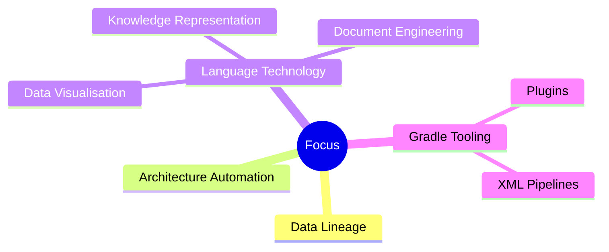

# Jurgen Hildebrand

Building tools for parsing, architecture modelling, XML processing and data lineage.

My long-term focus is to make the internals of complex IT landscapes visible and understandable through architecture-aware insights gained from years of hands-on work in banking and publishing.

## What I work on

 
Ongoing work on a unified knowledge representation framework based on XDM and S-expressions, enabling documents, code ASTs, enterprise architecture models, and structured data to be represented, queried, transformed, and exchanged through a common formal model:
  - [XDM, AST Metamodels, and S-Expressions for Human and AI Consumption](papers/UKIR_XDM_AST_SExpr_Paper.md)
  - [S-XDM Implementation Specification](papers/S-XDM-Implementation-Spec.md)
  - [ANTLR G4 to AST Classes Specification](papers/ANTLR_G4_to_AST_Classes_Spec.md)
- Data lineage derivation for existing enterprise applications
  - [Continuous Architecture Reconciliation](papers/continuous-architecture-reconcilliation.md)
- Visualization-oriented analysis of complex application internals
- Build reliability, security checks, and CI/CD hardening
- Published artifacts for Gradle plugin development and Maven Central publishing:
  - [Gradle Plugins](https://plugins.gradle.org/u/jurgenei)
  - [Maven Central](https://central.sonatype.com/namespace/name.jurgenei)

## Why this matters

Many critical systems are reliable in production but difficult to understand. I focus on turning hidden structure into clear, usable insight so teams can modernize safely, troubleshoot faster, and make better architectural decisions.

## Current focus

- Improving plugin reliability for real-world projects
- Hardening GitHub Actions workflows with secure defaults
- Keeping build pipelines fast, transparent, and maintainable

