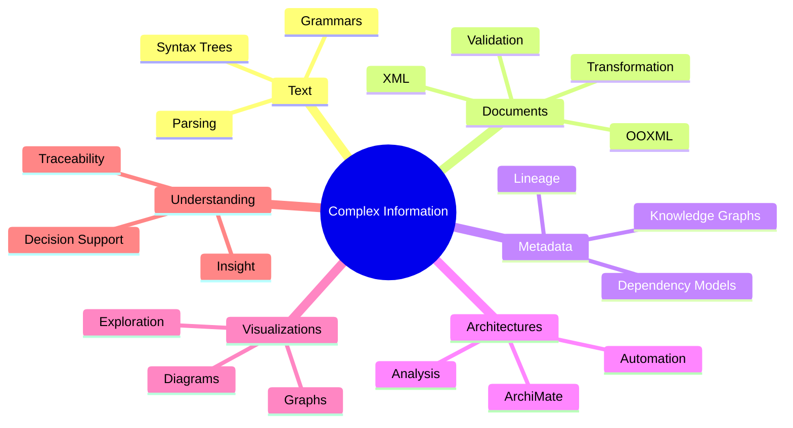
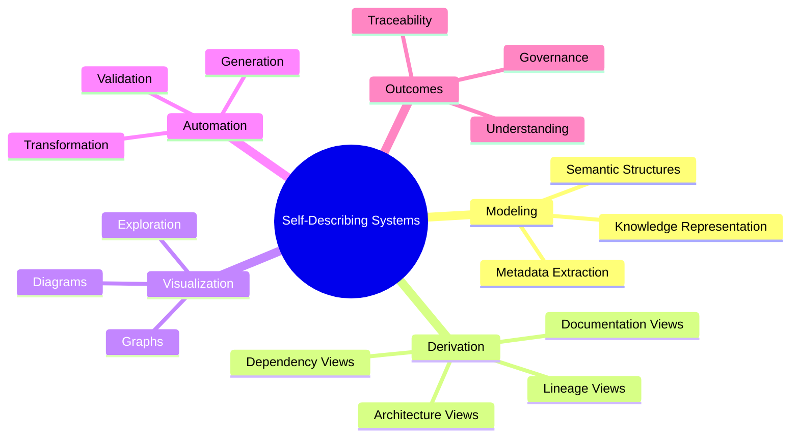

# Jurgen Hildebrand

Turning information into models and models into understanding.

## Examples

- Text → Trees
- Documents → Structures
- Metadata → Graphs
- Dependencies → Lineage
- Architectures → Models
- Data → Visualizations
- Complexity → Insight

## Focus Areas

- Language tooling
- Metadata management
- Data lineage
- Enterprise architecture
- Visualization
- Knowledge graphs

## Work

 
Ongoing work on a unified knowledge representation framework based on XDM and S-expressions, enabling documents, code ASTs, enterprise architecture models, and structured data to be represented, queried, transformed, and exchanged through a common formal model.

- Visualization-oriented analysis of complex application internals
- Build reliability, security checks, and CI/CD hardening
- Published artifacts for Gradle plugin development and Maven Central publishing:
  - [Gradle Plugins](https://plugins.gradle.org/u/jurgenei)
  - [Maven Central](https://central.sonatype.com/namespace/name.jurgenei)
- Some of my notes:
  - [XDM, AST Metamodels, and S-Expressions for Human and AI Consumption](papers/UKIR_XDM_AST_SExpr_Paper.md)
  - [S-XDM Implementation Specification](papers/S-XDM-Implementation-Spec.md)
  - [ANTLR G4 to AST Classes Specification](papers/ANTLR_G4_to_AST_Classes_Spec.md)
  - [Universal_Semantic_Lineage_Architecture](papers/Universal_Semantic_Lineage_Architecture.md) - Better Reasoning, Lower Cost, Reproducibility, and ESG
  - [Continuous Architecture Reconciliation](papers/continuous-architecture-reconcilliation.md) - Data lineage derivation for existing enterprise applications
  - [Extract, Derive, Resolve, Publish](papers/Extract-Derive-Resolve-Publish-Paper.md) - A Story About Structure, Understanding, and the Reuse of Knowledge
  - [Noema XExpr Whitepaper](papers/Noema_XExpr_Whitepaper.md) - A Unified Knowledge Representation Framework
- ongoing projects
  - [PlSql lineage example](https://github.com/jurgenei/example-lineage-plsql)   

## Why this matters

Many critical systems are reliable in production but difficult to understand. I focus on turning hidden structure into clear, usable insight so teams can modernize safely, troubleshoot faster, and make better architectural decisions.

# Looking Forward

