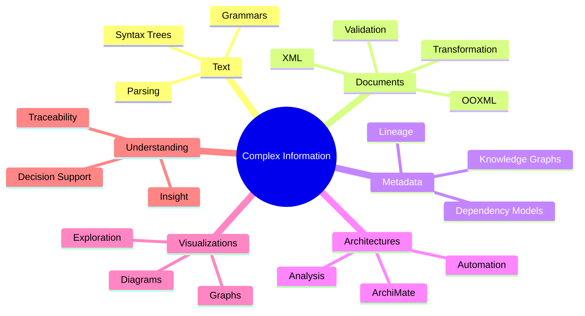
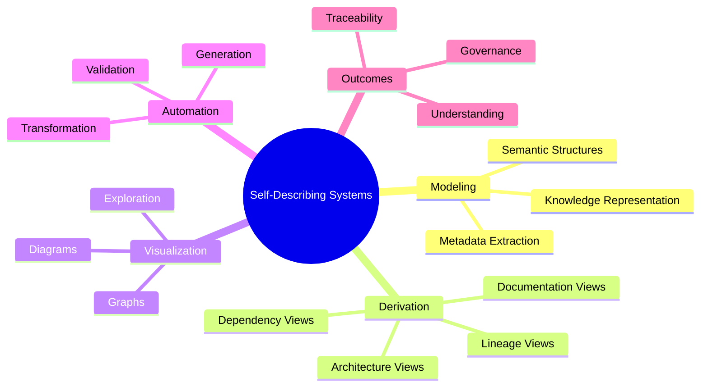

# Jurgen Hildebrand

Turning information into models and models into understanding.

## Examples

- Text → Trees
- Documents → Structures
- Metadata → Graphs
- Dependencies → Lineage
- Architectures → Models
- Data → Visualizations
- Complexity → Insight

## Focus Areas

- Language tooling
- Metadata management
- Data lineage
- Enterprise architecture
- Visualization
- Knowledge graphs

## Work

```mermaid
mindmap
  root((Complex Information))

    Text
      Grammars
      Parsing
      Syntax Trees

    Documents
      OOXML
      XML
      Validation
      Transformation

    Metadata
      Lineage
      Knowledge Graphs
      Dependency Models

    Architectures
      ArchiMate
      Analysis
      Automation

    Visualizations
      Diagrams
      Graphs
      Exploration

    Understanding
      Insight
      Traceability
      Decision Support
```
 
Ongoing work on XIR (eXtensible Intermediate Representation), a universal semantic representation framework based on XDM and S-expressions, enabling documents, code ASTs, enterprise architecture models, and structured data to be represented, queried, transformed, and exchanged through a common formal model.

- Visualization-oriented analysis of complex application internals
- Build reliability, security checks, and CI/CD hardening
- Published artifacts for Gradle plugin development and Maven Central publishing:
  - [Gradle Plugins](https://plugins.gradle.org/u/jurgenei)
  - [Maven Central](https://central.sonatype.com/namespace/name.jurgenei)
- Papers and specifications (curated reading paths):
  - **Start here: Data lineage story (gentle path)**
    1. [Extract, Derive, Resolve, Publish](papers/Extract-Derive-Resolve-Publish-Paper.md) - narrative introduction to turning fragmented information into reusable knowledge.
    2. [Universal Semantic Lineage Architecture](papers/Universal_Semantic_Lineage_Architecture.md) - practical architecture for deterministic lineage and reproducible reasoning.
    3. [Continuous Architecture Reconciliation](papers/continuous-architecture-reconcilliation.md) - near-reality lineage through continuous reconciliation of intent and implementation.
    4. [Executable Architecture to Enterprise Behavior Graphs](papers/Executable-Architecture-Enterprise-Behavior-Graphs.md) - end-to-end derivation from architecture models to behavior graphs.
  - **Running example alignment (`example-lineage-plsql`)**
    - [Project overview and staged lifecycle](https://github.com/jurgenei/example-lineage-plsql/blob/main/README.md) - executable walkthrough from architecture intent to verified lineage.
    - [Oracle PL/SQL lineage scenario](https://github.com/jurgenei/example-lineage-plsql/blob/main/oracle-plsql-lineage-example.md) - concrete source/target mappings, enrichment, derivation, and propagation.
    - [Architecture flow diagram](https://github.com/jurgenei/example-lineage-plsql/blob/main/ARCHITECTURE.md) - orchestration of architecture, lineage artifacts, and graph verification.
    - Reproducible tasks: `./gradlew generateLineage`, `./gradlew verifyKnowledgeGraph`, `./gradlew endToEndTest`.
  - **Then go deeper: semantic foundation and standards**
    1. [XIR Structural Model and S-Expression Serialization](papers/XIR_Structural_Model_Paper.md) - canonical structural model for cross-domain representation.
    2. [XIR Implementation Specification](papers/XIR-Implementation-Spec.md) - implementation contracts and conformance details.
    3. [XIR Positioning Note](papers/XIR_W3C_Positioning_Note.md) - relation to XML, RDF, SKOS, SHACL, PROV-O, and OpenLineage.
    4. [XIR W3C Merged Paper](papers/XIR_W3C_Merged_Paper.md) - consolidated standards-oriented version.
  - **Governance, evidence, and ontology alignment**
    1. [Evidence-Oriented Enterprise Knowledge Graph Federation](papers/XIR-GOV-Evidence-Oriented-Enterprise-Knowledge-Graph-Federation.md) - evidence-first governance and federated graph architecture.
    2. [Observation-Driven Ontology Alignment](papers/Observation-Driven_Ontology_Alignment.md) - explicit, auditable alignment of source and governance semantics.
    3. [RDF, SKOS and the Collibra Model](papers/RDF_SKOS_Collibra_Mapping.md) - practical mapping trade-offs and cognitive load reduction.
  - **Methods, language, and implementation extensions**
    1. [SEL Derivation Language](papers/SEL-Derivation-Language.md) - derivation DSL and normative processing model.
    2. [ANTLR G4 to AST Classes Specification](papers/ANTLR_G4_to_AST_Classes_Spec.md) - schema derivation from grammars for structured extraction.
    3. [XIR vs CAST](papers/XIR_vs_CAST_Paper.md) - positioning against software intelligence tooling.
    4. [Noema XIR Whitepaper](papers/Noema_XIR_Whitepaper.md) - long-horizon vision for self-describing systems.
- ongoing projects
  - [PlSql lineage example](https://github.com/jurgenei/example-lineage-plsql)   

## Why this matters

Many critical systems are reliable in production but difficult to understand. I focus on turning hidden structure into clear, usable insight so teams can modernize safely, troubleshoot faster, and make better architectural decisions.

## Looking Forward

```mermaid
mindmap
  root((Self-Describing Systems))
    Modeling
      Knowledge Representation
      Metadata Extraction
      Semantic Structures

    Derivation
      Architecture Views
      Lineage Views
      Dependency Views
      Documentation Views

    Visualization
      Graphs
      Diagrams
      Exploration

    Automation
      Validation
      Transformation
      Generation

    Outcomes
      Traceability
      Understanding
      Governance
```
