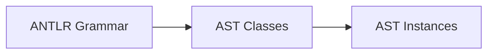
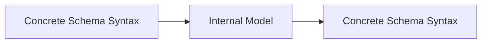
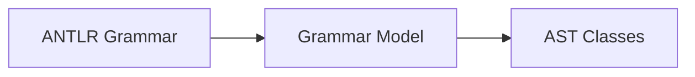
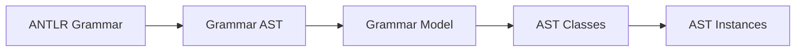
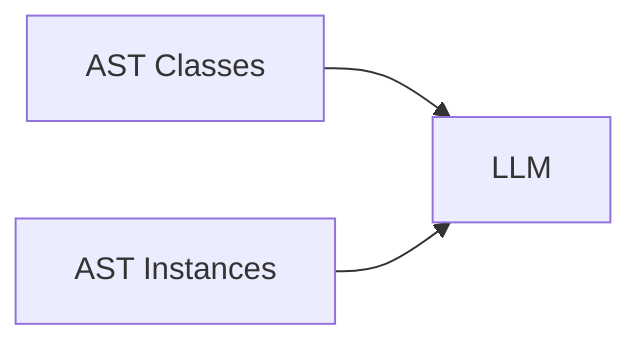
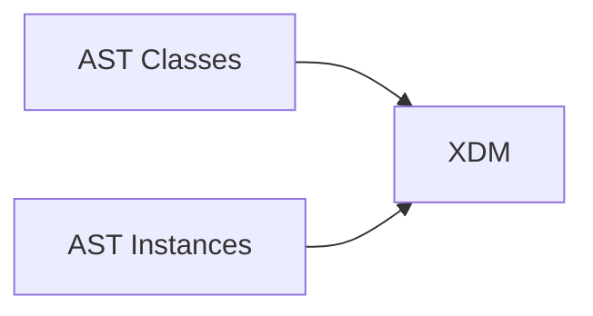
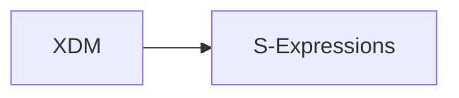
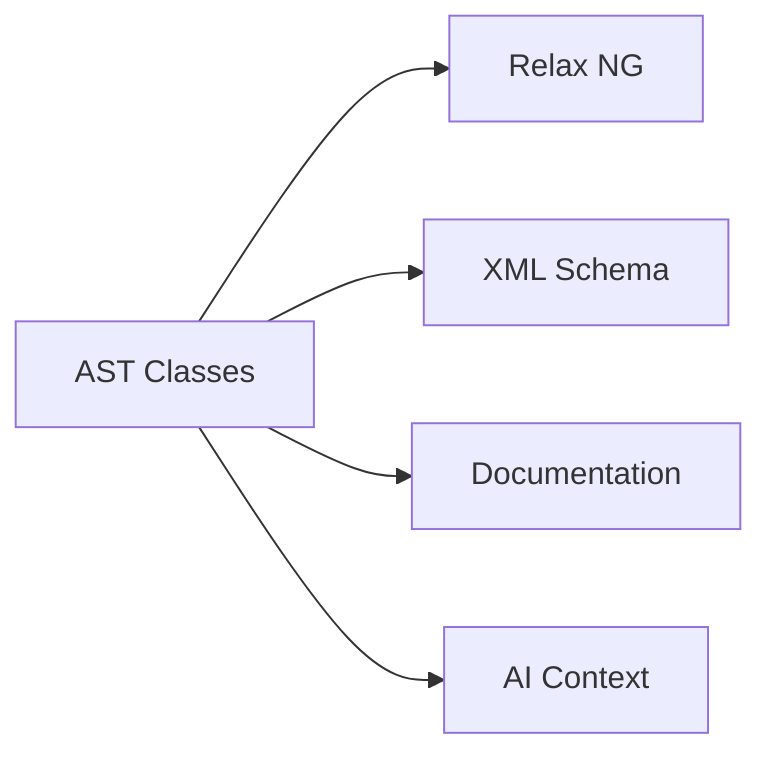
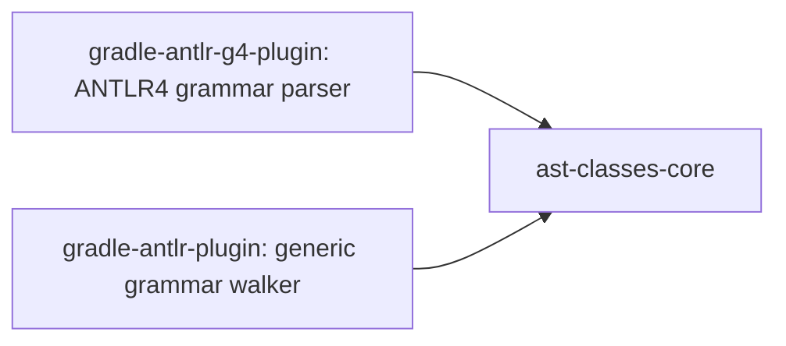
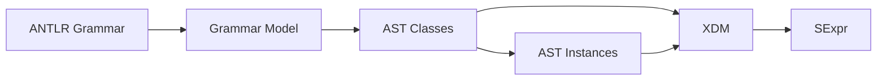

# Deriving AST Classes from ANTLR4 Grammars

Work in progess [ast-classes-core](https://github.com/jurgenei/ast-classes-core), [gradle-antlr-g4-plugin](https://github.com/jurgenei/gradle-antlr-g4-plugin)

## Abstract

This specification defines an implementable architecture for deriving AST Classes and AST Instances from ANTLR4 grammars. The goal is to create a language-independent structural representation that improves AI reasoning across multiple languages, models, documents, and knowledge domains.

The approach introduces an AST Class layer between grammar definitions and AST instances. The AST Class layer acts as a semantic model that can be serialized as S-expressions, represented in XDM, transformed to schemas, and supplied to AI systems as compact semantic context.

---

# Motivation

## Problem

Current AI systems must repeatedly infer semantics from syntax.

For every grammar:

- SQL
- PL/SQL
- Java
- C#
- ArchiMate
- BPMN
- XML

an LLM must reconstruct concepts, relationships, and constraints from examples.

This creates:

- token inefficiency
- semantic ambiguity
- duplicated learning effort
- poor cross-language reasoning

## Goal

Introduce an intermediate semantic layer:



The AST Classes describe the concepts of a language.

The AST Instances describe actual parsed artifacts.

AI systems receive both.

## Expected Benefits

- Improved semantic density.
- Reduced ambiguity.
- Better cross-language reasoning.
- Better context compression.
- Uniform representation across domains.
- Easier generation of documentation and schemas.

---

# Inspiration from Trang

Trang follows the pattern:



Examples:

- DTD → Internal Model → Relax NG
- Relax NG → Internal Model → XSD

The proposed AST Class derivation follows the same architectural principle.



The Grammar Model is analogous to Trang's internal schema model.

The AST Classes become the semantic layer.

---

# Core Architecture



---

# Stage 1: Grammar AST

The existing ANTLR grammar parser produces a Grammar AST.

Example:

```antlr
assignment
  : target=identifier
    '='
    value=expression
  ;
```

Grammar AST (conceptual):

```lisp
(rule assignment
  (sequence
    (label target (ruleRef identifier))
    (literal "=")
    (label value (ruleRef expression))))
```

This stage is already implemented by the ANTLR grammar infrastructure.

---

# Stage 2: Grammar Model

The Grammar Model normalizes parser constructs.

Allowed concepts:

```text
Rule
Sequence
Choice
Optional
Repeat
Repeat1
RuleReference
Literal
Label
```

Example:

```lisp
(rule assignment
  (sequence
      (label target identifier)
      (literal "=")
      (label value expression)))
```

No semantic meaning is introduced yet.

---

# Stage 3: AST Class Derivation

## Rule 1: Parser Rule -> AST Class

```antlr
assignment
```

becomes:

```lisp
(class Assignment)
```

---

## Rule 2: Labels -> Named Relationships

```antlr
assignment
 : target=identifier
   '='
   value=expression
 ;
```

becomes:

```lisp
(class Assignment)

(rel Assignment target Identifier 1)
(rel Assignment value Expression 1)
```

---

## Rule 3: Cardinalities

ANTLR cardinalities are preserved.

| Grammar | Cardinality |
|----------|--------------|
| element | 1 |
| element? | ? |
| element* | * |
| element+ | + |

Example:

```antlr
parameter*
```

becomes:

```lisp
(rel Procedure parameter Parameter *)
```

---

## Rule 4: Alternatives -> Inheritance

```antlr
expression
  : functionCall
  | binaryExpression
  | literal
  ;
```

becomes:

```lisp
(class Expression)

(isa FunctionCall Expression)
(isa BinaryExpression Expression)
(isa Literal Expression)
```

---

## Rule 5: Literals Are Structural Noise

Example:

```antlr
identifier '=' expression ';'
```

The literals are ignored.

```text
=
;
```

Do not become AST Classes.

---

# AST Class Language

Minimal vocabulary:

```lisp
(class Assignment)

(rel Assignment target Identifier 1)

(rel Assignment value Expression 1)

(ref VariableReference declaration VariableDeclaration 1)

(isa BinaryExpression Expression)
```

Definitions:

- class = concept
- rel = containment relationship
- ref = reference relationship
- isa = inheritance

Cardinalities:

```text
1
?
*
+
```

---

# AST Instances

Input source:

```java
salary = 1000;
```

AST Instance:

```lisp
(Assignment
  (target
    (Identifier salary))
  (value
    (Literal 1000)))
```

The AST Instance must conform to the AST Classes.

---

# AI Usage

## AI Receives



The class model provides:

- concepts
- roles
- references
- inheritance
- cardinalities

The instance provides:

- actual data

## Example

AST Classes:

```lisp
(class Assignment)
(rel Assignment target Identifier 1)
(rel Assignment value Expression 1)
```

AST Instance:

```lisp
(Assignment
    (target (Identifier salary))
    (value (Literal 1000)))
```

The AI no longer needs to infer the meaning of target and value.

The semantic structure is explicit.

---

# Relation to the SExpr Ecosystem

## Grammar Layer

Existing:

- gradle-antlr-g4-plugin: ANTLR4 grammar parser
- gradle-antlr-plugin: generic grammar walker

Produces:

```text
ANTLR Grammar
Grammar AST
Grammar Model
```

---

## AST Class Layer

New repository:

```text
ast-classes-core
```

Responsibilities:

- AST Class derivation
- AST Class storage
- AST validation
- AST documentation support

---

## XDM Layer

AST Classes and AST Instances are representable as XDM.



---

## S-Expression Layer

Canonical human and AI representation.



Examples:

```lisp
(class Assignment)
```

```lisp
(Assignment
    (target (Identifier salary))
    (value (Literal 1000)))
```

---

## Future Schema Generation

The AST Classes become the canonical source.



Potential reuse of modernized Trang infrastructure belongs at this layer.

---

# Recommended Repository Structure

```text
gradle-antlr-plugin
gradle-antlr-g4-plugin
xml-sax-sexpr
jing-trang (modernized)

ast-classes-core
```

Dependency direction:



The AST Class layer remains independent of ANTLR.

---

# Summary

The proposed architecture introduces AST Classes between ANTLR grammars and AST instances.



The AST Classes become the semantic vocabulary of a language and provide a compact, explicit, AI-friendly representation that can be shared across grammars, languages, models, and knowledge domains.
