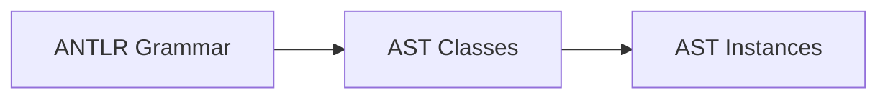
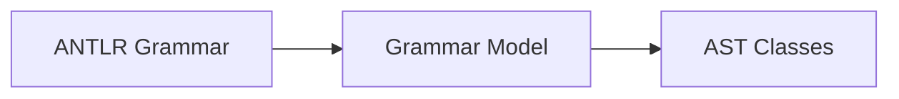
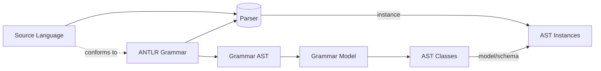
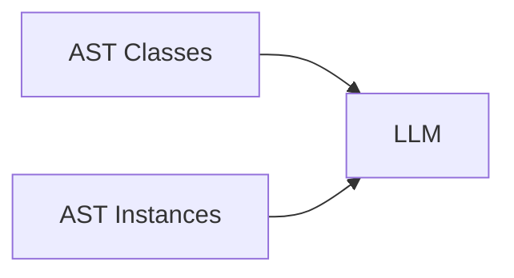
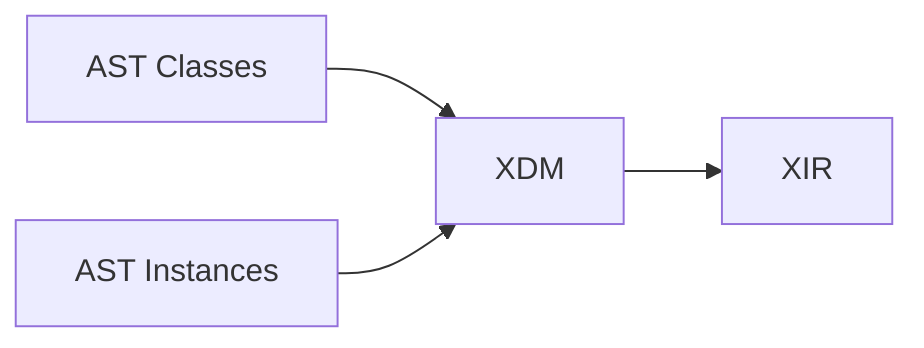
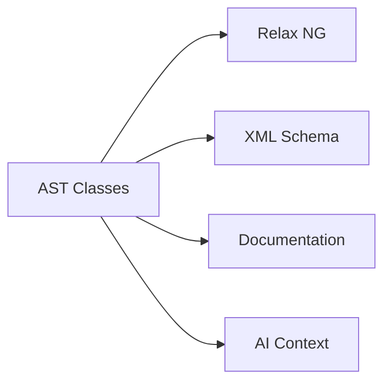
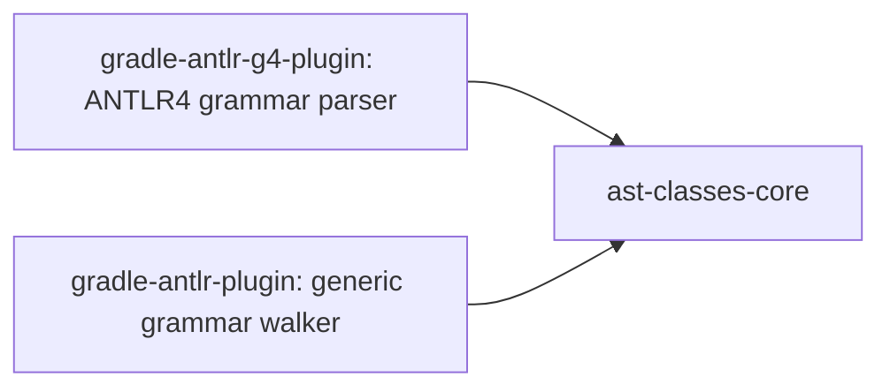
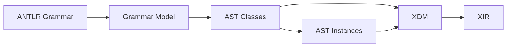

# Deriving AST Classes from ANTLR4 Grammars

Work in progess [ast-classes-core](https://github.com/jurgenei/ast-classes-core), [gradle-antlr-plugin](https://github.com/jurgenei/gradle-antlr-plugin)

## Abstract

This specification defines an implementable architecture for deriving AST Classes and AST Instances from ANTLR4 grammars. The goal is to create a language-independent structural representation that improves AI reasoning across multiple languages, models, documents, and knowledge domains.

The approach introduces an AST Class layer between grammar definitions and AST instances. The AST Class layer acts as a semantic model that can be serialized as XIR (eXtensible Intermediate Representation), an S-expression format representing XDM (XML Data Model). XIR enables transformation to schemas, interoperability with XDM-compliant systems, and distribution to AI systems as compact semantic context.

---

# Motivation

## Problem

Current AI systems must repeatedly infer semantics from syntax.

For every grammar:

- SQL
- PL/SQL
- Java
- C#
- ArchiMate
- BPMN
- XML

an LLM must reconstruct concepts, relationships, and constraints from examples.

This creates:

- token inefficiency
- semantic ambiguity
- duplicated learning effort
- poor cross-language reasoning

## Goal

Introduce an intermediate semantic layer:


```mermaid
flowchart LR
    G[ANTLR Grammar]
    C[AST Classes]
    I[AST Instances]

    G --> C
    C --> I
```

The AST Classes describe the concepts of a language.

The AST Instances describe actual parsed artifacts.

AI systems receive both.

## Expected Benefits

- Improved semantic density.
- Reduced ambiguity.
- Better cross-language reasoning.
- Better context compression.
- Uniform representation across domains.
- Easier generation of documentation and schemas.

---

# Inspiration from Trang

Trang follows the pattern:


```mermaid
flowchart LR
    A[Concrete Schema Syntax]
    B[Internal Model]
    C[Concrete Schema Syntax]

    A --> B
    B --> C
```

Examples:

- DTD → Internal Model → Relax NG
- Relax NG → Internal Model → XSD

The proposed AST Class derivation follows the same architectural principle.


```mermaid
flowchart LR
    G[ANTLR Grammar]
    M[Grammar Model]
    C[AST Classes]

    G --> M
    M --> C
```

The Grammar Model is analogous to Trang's internal schema model.

The AST Classes become the semantic layer.

---

# Core Architecture


```mermaid
flowchart LR

    L[Source Language]
    G[ANTLR Grammar]
    P[(Parser)]
    GA[Grammar AST]
    GM[Grammar Model]
    AC[AST Classes]
    AI[AST Instances]

    L -. conforms to .-> G
    L --> P
    G --> GA
    G --> P
    P -- instance  --> AI 
    GA --> GM
    GM --> AC
    AC -- model/schema --> AI 
```

---

# Stage 1: Grammar AST

The existing ANTLR grammar parser produces a Grammar AST.

Example:

```antlr
assignment
  : target=identifier
    '='
    value=expression
  ;
```

Grammar AST (conceptual):

```lisp
(rule assignment
  (sequence
    (label target (ruleRef identifier))
    (literal "=")
    (label value (ruleRef expression))))
```

This stage is already implemented by the ANTLR grammar infrastructure.

---

# Stage 2: Grammar Model

The Grammar Model normalizes parser constructs.

Allowed concepts:

```text
Rule
Sequence
Choice
Optional
Repeat
Repeat1
RuleReference
Literal
Label
```

Example:

```lisp
(rule assignment
  (sequence
      (label target identifier)
      (literal "=")
      (label value expression)))
```

No semantic meaning is introduced yet.

---

# Stage 3: AST Class Derivation

## Rule 1: Parser Rule -> AST Class

```antlr
assignment
```

becomes:

```lisp
(class "Assignment")
```

---

## Rule 2: Labels -> Named Relationships

```antlr
assignment
 : target=identifier
   '='
   value=expression
 ;
```

becomes:

```lisp
(class "Assignment")

(rel { source "Assignment" name "target" type "Identifier" cardinality "1" })
(rel { source "Assignment" name "value" type "Expression" cardinality "1" })
```

---

## Rule 3: Cardinalities

ANTLR cardinalities are preserved.

| Grammar | Cardinality |
|----------|--------------|
| element | 1 |
| element? | ? |
| element* | * |
| element+ | + |

Example:

```antlr
parameter*
```

becomes:

```lisp
(rel { source "Procedure" name "parameter" type "Parameter" cardinality "*" })
```

---

## Rule 4: Alternatives -> Inheritance

```antlr
expression
  : functionCall
  | binaryExpression
  | literal
  ;
```

becomes:

```lisp
(class "Expression")

(isa { subclass "FunctionCall" superclass "Expression" })
(isa { subclass "BinaryExpression" superclass "Expression" })
(isa { subclass "Literal" superclass "Expression" })
```

---

## Rule 5: Literals Are Structural Noise

Example:

```antlr
identifier '=' expression ';'
```

The literals are ignored.

```text
=
;
```

Do not become AST Classes.

---

# AST Class Language

Minimal vocabulary:

```lisp
(class "Assignment")

(rel { source "Assignment" name "target" type "Identifier" cardinality "1" })

(rel { source "Assignment" name "value" type "Expression" cardinality "1" })

(ref { source "VariableReference" name "declaration" type "VariableDeclaration" cardinality "1" })

(isa { subclass "BinaryExpression" superclass "Expression" })
```

Definitions:

- `class` = concept (single text child with concept name)
- `rel` = containment relationship (map with keys: source, name, type, cardinality)
- `ref` = reference relationship (map with keys: source, name, type, cardinality)
- `isa` = inheritance (map with keys: subclass, superclass)

Cardinalities:

```text
"1"
"?"
"*"
"+"
```

**XDM Conformance & XML Roundtripping:** Maps provide named keys, preserving semantic meaning through XML serialization/deserialization. All keys and values are quoted text.

---

# AST Instances

Input source:

```java
salary = 1000;
```

AST Instance:

```lisp
(Assignment
  (target
    (Identifier "salary"))
  (value
    (Literal "1000")))
```

The AST Instance must conform to the AST Classes.

**XDM Conformance:** All data values and identifiers are properly quoted as text nodes.

---

# AI Usage

## AI Receives


```mermaid
flowchart LR

    AC[AST Classes]
    AI[AST Instances]

    AC --> LLM[LLM]
    AI --> LLM
```

The class model provides:

- concepts
- roles
- references
- inheritance
- cardinalities

The instance provides:

- actual data

## Example

AST Classes:

```lisp
(class "Assignment")
(rel { source "Assignment" name "target" type "Identifier" cardinality "1" })
(rel { source "Assignment" name "value" type "Expression" cardinality "1" })
```

AST Instance:

```lisp
(Assignment
    (target (Identifier "salary"))
    (value (Literal "1000")))
```

The AI no longer needs to infer the meaning of target and value.

The semantic structure is explicit.

---

# Relation to the SExpr Ecosystem

## Grammar Layer

Existing:

- gradle-antlr-g4-plugin: ANTLR4 grammar parser
- gradle-antlr-plugin: generic grammar walker

Produces:

```text
ANTLR Grammar
Grammar AST
Grammar Model
```

---

## AST Class Layer

New repository:

```text
ast-classes-core
```

Responsibilities:

- AST Class derivation
- AST Class storage
- AST validation
- AST documentation support

---

## XDM Layer

AST Classes and AST Instances are representable as XDM and serialized via XIR (eXtensible Intermediate Representation).


```mermaid
flowchart LR
    AC[AST Classes]
    X[XDM]
    XIR[XIR]
    AI[AST Instances]

    AC --> X
    AI --> X
    X --> XIR
```

XIR provides the canonical S-expression serialization that enforces XDM conformance.

---

## S-Expression Layer

Canonical human and AI representation using XIR serialization.


```mermaid
flowchart LR
    X[XDM]
    S[S-Expressions]

    X --> S
```

Examples:

AST Class in XIR:

```lisp
(class "Assignment")
```

AST Instance in XIR:

```lisp
(Assignment
    (target (Identifier "salary"))
    (value (Literal "1000")))
```

Both forms are valid XDM and can be serialized as S-expressions using XIR canonical syntax.

---

## XIR Representation and XDM Conformance

AST Classes and AST Instances are serialized as XIR documents that conform to XDM (XML Data Model).

**Key Requirements:**

1. **Named Keys in Maps:** Relationships use maps with named keys for robust XML roundtripping.
   
   Invalid (positional): `(rel "Assignment" "target" "Identifier" "1")` — order fragility during serialization.
   
   Valid (map): `(rel { source "Assignment" name "target" type "Identifier" cardinality "1" })` — semantics preserved.

2. **Inheritance with Maps:** Inheritance relationships use maps with subclass/superclass keys.
   
   Invalid (positional): `(isa "BinaryExpression" "Expression")` — order fragility.
   
   Valid (map): `(isa { subclass "BinaryExpression" superclass "Expression" })` — semantic clarity.

3. **Element Names:** Element names like `class`, `rel`, `ref`, `isa` are ordinary XML element names.
   
   Valid: `(class "Assignment")` ✓
   
   Invalid: `(class Assignment)` ✗

4. **Child Nodes:** Only these XDM node types are valid as element children:
   - Text nodes: `"value"`
   - Child elements: `(target (Identifier "salary"))`
   - Maps: `{ source "Assignment" name "target" type "Identifier" cardinality "1" }`
   - Sequences: `[ "item1" "item2" ]`

5. **No Bare Symbols:** Unquoted identifiers are NOT valid XDM values.

This conformance ensures AST Classes and Instances can interoperate with any system consuming XDM/XIR, including schema generators, AI systems, and documentation tools.

---

## Future Schema Generation

The AST Classes become the canonical source.


```mermaid
flowchart LR

    AC[AST Classes]

    AC --> RNG[Relax NG]
    AC --> XSD[XML Schema]
    AC --> DOC[Documentation]
    AC --> AI[AI Context]
```

Potential reuse of modernized Trang infrastructure belongs at this layer.

---

# Recommended Repository Structure

```text
gradle-antlr-plugin
gradle-antlr-g4-plugin
xml-sax-sexpr
jing-trang (modernized)

ast-classes-core
```

Dependency direction:


```mermaid
flowchart LR

    AC[ast-classes-core]

    G4[gradle-antlr-g4-plugin: ANTLR4 grammar parser]
    GW[gradle-antlr-plugin: generic grammar walker]

    G4 --> AC
    GW --> AC
```

The AST Class layer remains independent of ANTLR.

---

# Summary

The proposed architecture introduces AST Classes between ANTLR grammars and AST instances.


```mermaid
flowchart LR

    G[ANTLR Grammar]
    GM[Grammar Model]
    AC[AST Classes]
    AI[AST Instances]
    X[XDM]
    XIR[XIR]

    G --> GM
    GM --> AC
    AC --> AI
    AC --> X
    AI --> X
    X --> XIR
```

The AST Classes become the semantic vocabulary of a language and provide a compact, explicit, AI-friendly representation that can be shared across grammars, languages, models, and knowledge domains.

AST Classes and Instances are serialized via XIR (S-expressions representing XDM). XIR conformance ensures:

- All identifiers and values are properly quoted text nodes
- Structures conform to XDM node types (elements, text, maps, sequences)
- Interoperability with XDM-compliant systems and schema generators
- Portable representation across documentation, AI, and transformation tools
