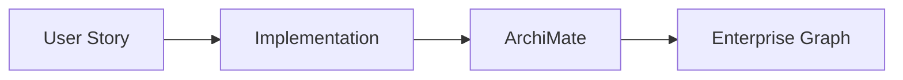
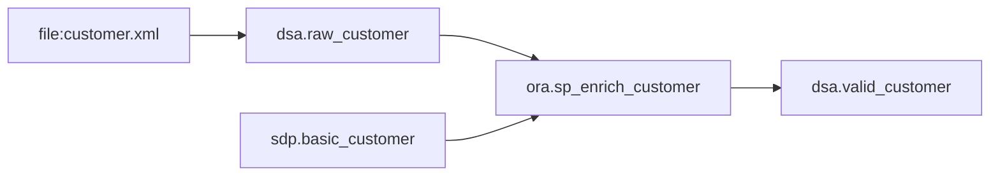
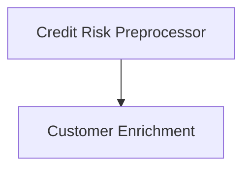
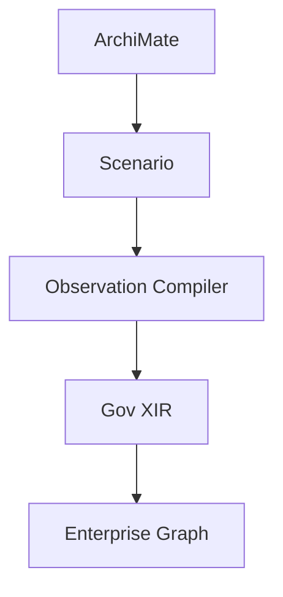
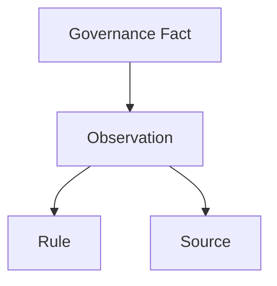
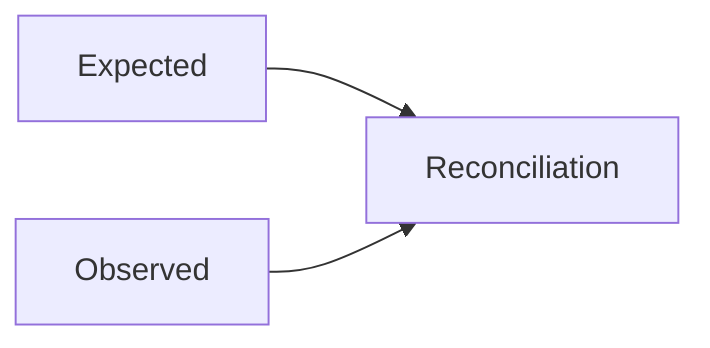
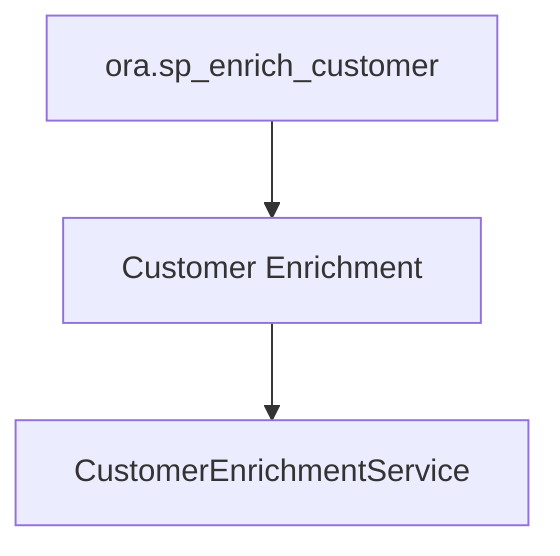

# From Executable Architecture to Enterprise Behavior Graphs
## ArchiMate-Driven Derivation, Provenance, and AI-Assisted Modernization Using XIR

## Abstract

Enterprise lineage initiatives are frequently justified through regulatory requirements such as BCBS239. While lineage is valuable, it is not the highest-value outcome. The greater challenge facing many organizations is modernization: understanding decades of accumulated business logic embedded in databases, stored procedures, configuration tables, reference data, batch pipelines, and integration processes.

This paper proposes an architecture in which ArchiMate models act as executable architecture specifications. Application components describe derivation scenarios that guide observation and extraction of implementation knowledge. Observations are normalized into a governance-oriented knowledge graph using XIR and compiled extraction logic.

The resulting graph captures enterprise behavior independently from implementation technology. Lineage, auditability, architecture drift detection, service discovery, business-rule extraction, and AI-assisted modernization become projections of the same underlying representation.

---

## Document Relationship

This paper defines system-level architecture, lifecycle, and modernization outcomes.

Canonical semantic boundaries for observation, interpretation, governance normalization, and projection are maintained in companion paper:

- [Observation-Driven Ontology Alignment](./Observation-Driven_Ontology_Alignment.md)
- [Canonical Terms (Glossary)](./Observation-Driven_Ontology_Alignment.md#glossary-canonical-terms)
- [End-to-End Alignment Flow](./Observation-Driven_Ontology_Alignment.md#end-to-end-alignment-flow)

Use this paper for behavior-graph architecture and modernization context.  
Use companion paper for term ownership and alignment method.

---

# 1. Introduction

Traditional lineage architectures focus on answering:

> Where did this data come from?

Modernization programs require answering a more difficult question:

> What does the system actually do?

Business logic is often distributed across:

- Oracle PL/SQL procedures
- Configuration tables
- Reference data
- File interfaces
- Batch processes
- Application metadata

Understanding this behavior is prerequisite to:

- modernization
- microservice extraction
- AI-assisted migration
- regulatory lineage
- auditability

This paper argues that lineage should be viewed as evidence produced while discovering enterprise behavior.

---

# 2. Architectural Thesis

The central idea is:

```text
Enterprise Behavior
        ↓
      XIR
        ↓
 Enterprise Knowledge Graph
```

Lineage is not the objective.

Lineage is a view.

Other views include:

- modernization
- service decomposition
- architecture recovery
- impact analysis
- auditability
- governance

---

# 3. Executable Architecture

Unlike traditional documentation-centric approaches, ArchiMate is treated as executable architecture.

Development teams update architecture models as part of Definition-of-Done.

The architecture therefore evolves together with implementation.



The resulting graph approaches operational reality rather than periodic documentation snapshots.

---

# 4. Namespace Model

The architecture uses namespaces representing observation domains.

```text
archi:  architecture intent
ora:    Oracle implementation
file:   file interfaces
sdp:    authoritative business data
dsa:    operational processing area
obs:    observations
prov:   provenance
map:    semantic mappings
gov:    governance ontology
```

Namespaces separate concerns while enabling federation.

For application semantics, `gov` uses explicit hierarchy:

```text
gov:ApplicationLandscape
        ↓
gov:Application
        ↓
gov:ApplicationComponent
```

Canonical boundary definitions are owned by companion paper:
[Observation-Driven Canonical Terms](./Observation-Driven_Ontology_Alignment.md#glossary-canonical-terms).

---

# 5. Running Example

A Credit Risk Preprocessor receives customer information.

Input file:

```text
file:customer.xml
```

Operational table:

```text
dsa.raw_customer
```

Authoritative customer source:

```text
sdp.basic_customer
```

Implementation:

```text
ora.sp_enrich_customer
```

Output:

```text
dsa.valid_customer
```

---

# 6. Customer Enrichment Scenario

The preprocessing application enriches operational customers using risk information maintained elsewhere.



Example attributes sourced from SDP:

```text
CustomerId
RiskRating
PD
```

Example attributes arriving operationally:

```text
CustomerId
Name
Address
```

The result becomes a semantically enriched customer.

---

# 7. Derivation Scenarios

A derivation scenario is a reusable behavior pattern attached to an application component.

Definition:

> A derivation scenario describes how an application component realizes a business capability through interactions with data, reference data, configuration, procedures, services, or files.

Example:

```text
Scenario:
    Customer Enrichment

Reads:
    dsa.raw_customer

Reads:
    sdp.basic_customer

Implementation:
    ora.sp_enrich_customer

Produces:
    dsa.valid_customer
```

---

# 8. ArchiMate as Derivation Driver

Application components describe expected behavior.



The derivation engine consumes this model and determines which extraction patterns to execute.



---

# 9. Observation Model
<a id="obs-model"></a>

Observations connect expected architecture to observed implementation.

Conceptually:

```text
Observation
    ↓
Evidence
    ↓
Governance Fact
```

Example:

```xir
(obs:Observation
   {id "obs-001"}

   (obs:Source ora:sp_enrich_customer)

   (obs:Produces gov:CustomerEnrichment))
```

---

# 10. Evidence and Interpretation
<a id="evidence-interpretation"></a>

## Introduction

Evidence and interpretation are separate concerns.  
Canonical definitions live in companion glossary:

- [Observation-Driven Canonical Terms](./Observation-Driven_Ontology_Alignment.md#glossary-canonical-terms)
- [Observation Before Interpretation](./Observation-Driven_Ontology_Alignment.md#observation-before-interpretation)
- [Interpretation Before Projection](./Observation-Driven_Ontology_Alignment.md#interpretation-before-projection)

Evidence answers:

```text
What was observed?
```

Interpretation answers:

```text
What does it mean?
```

## Evidence

Evidence is collected from enterprise sources.

### Architecture Evidence

```text
archi:ApplicationComponent
```

### Configuration Evidence

```text
Distribution:
CustomerDistribution
```

### SQL Evidence

```text
PREPROCESS_INPUT
calls
DISTRIBUTE_CUSTOMERS
```

### Lineage Evidence

```text
STAGE.CUSTOMER
    ↓
ODS.CUSTOMER
```

### File Evidence

```text
customer_in.xml
    ↓
PREPROCESS_INPUT
    ↓
customer_out.xml
```

## Interpretation

Interpretation assigns governance meaning.

Example:

Evidence:

```text
archi:ApplicationComponent
```

Interpretation:

```text
gov:ApplicationComponent
```

Optional contextual derivation:

```text
gov:ApplicationComponent
        ↓ (grouping by context/ownership)
gov:Application
```

Evidence:

```text
sap:Uses
```

Interpretation:

```text
gov:Consumes
```

## Interpretation Layer

```text
Evidence
    ↓
Observation
    ↓
Interpretation
    ↓
Governance Concept
```

## Confidence

Evidence may have different confidence levels.

```text
SQL Parse                100%
Configuration Metadata    95%
Naming Convention         50%
AI Inference              25%
```

Confidence applies to evidence.
Interpretation remains traceable to originating evidence.

## Traceability

Every governance concept should be explainable.

```text
gov:ApplicationComponent
        ↑
 Interpretation
        ↑
 Observation
        ↑
 Evidence
```

## Enterprise Graph Perspective

Evidence, interpretation and governance concepts coexist in the graph.

```text
Evidence Node
      ↓
Interpretation Node
      ↓
Governance Node
```

This enables auditability, lineage reconstruction and future reinterpretation as ontologies evolve.

## Governance Normalization and Projection

This paper uses `gov:*` as canonical governance layer and treats lineage/compliance as derived projections.  
Normalization and projection contract defined in companion paper:

- [Governance Namespace](./Observation-Driven_Ontology_Alignment.md#governance-namespace)
- [Governance Normalization](./Observation-Driven_Ontology_Alignment.md#glossary-canonical-terms)
- [Interpretation Before Projection](./Observation-Driven_Ontology_Alignment.md#interpretation-before-projection)

---

# 11. Provenance Model

Governance facts must be explainable.



Every fact should answer:

- why does it exist?
- where was it observed?
- which rule created it?
- which implementation realizes it?

---

# 12. Expected Versus Observed Reality

A critical distinction exists between:

```text
Expected Architecture
```

and

```text
Observed Reality
```



This enables:

- architecture drift detection
- undocumented implementation detection
- orphaned logic detection

---

# 12. Enterprise Behavior Graph

The graph stores behavior rather than merely metadata.

Example behavior:

```text
Customer Enrichment
```

Current realization:

```text
ora.sp_enrich_customer
```

Future realization:

```text
CustomerEnrichmentService
```

The behavior remains stable while implementation changes.

---

# 13. Modernization

Modernization becomes the primary use case.

Current state:

```text
Business Rule
    ↓
PL/SQL
```

Target state:

```text
Business Rule
    ↓
Java Service
```

The graph allows extraction of:

- business rules
- dependencies
- data contracts
- service candidates

---

# 14. Service Candidate Derivation



The service boundary is derived from discovered behavior rather than database objects.

---

# 15. AI-Assisted Migration

AI should not operate directly on millions of lines of SQL.

Instead AI should consume the enterprise behavior graph.

```text
PLSQL
    ↓
Behavior Graph
    ↓
AI
    ↓
Java Service Candidate
```

The graph becomes a semantic intermediate representation.

---

# 16. Regulatory Lineage as a Projection
<a id="regulatory-projection"></a>

BCBS239 lineage becomes a derived view.

Question:

```text
Why does customer C123 have PD 0.25%?
```

Answer:

```text
dsa.valid_customer

    ↓

Customer Enrichment

    ↓

ora.sp_enrich_customer

    ↓

sdp.basic_customer

    ↓

PD = 0.25%
```

The platform stores both the answer and the proof.

---

# 17. Benefits

## Executives

- reduced modernization risk
- lower dependency on legacy specialists
- better architecture visibility

## Architects

- near-reality architecture
- drift detection
- executable architecture

## Developers

- service candidate discovery
- dependency discovery
- impact analysis

## Auditors

- traceability
- provenance
- explainability

---

# 18. Conclusion

The architecture presented in this paper treats ArchiMate models as executable architecture specifications.

Application components describe derivation scenarios which drive observation and extraction of enterprise behavior from files, databases, procedures, reference data, and configuration.

The resulting enterprise knowledge graph preserves behavior independently from implementation technology.

Modernization becomes the primary objective.

Lineage, auditability, governance, and compliance emerge as natural projections of the same underlying behavioral representation.

The enterprise graph therefore becomes not a catalog of technical assets, but a representation of how the enterprise actually works.
