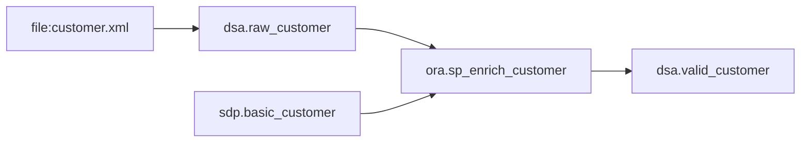
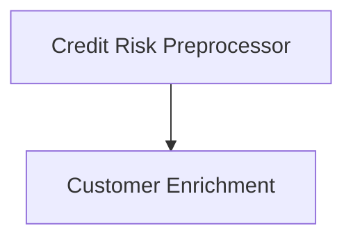
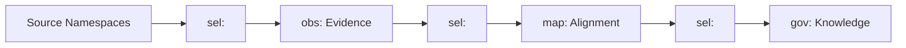
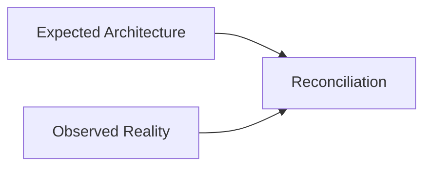
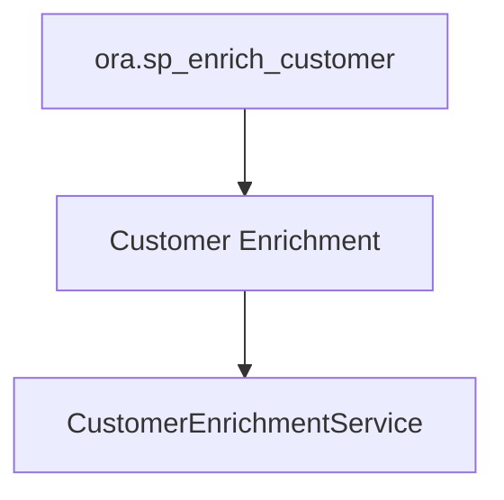

# From Executable Architecture to Enterprise Behavior Graphs (v2)
## ArchiMate-Driven Derivation, Provenance, Governance, and AI-Assisted Modernization Using XIR

## Abstract

This paper presents an architecture in which ArchiMate models act as executable architecture specifications. Application components define derivation scenarios that drive extraction of implementation knowledge from files, databases, procedures, configuration, and reference data. Knowledge extraction, governance normalization, provenance generation, and ontology alignment are expressed as derivations. The resulting enterprise knowledge graph captures enterprise behavior independently from implementation technology and supports modernization, service discovery, auditability, lineage, and governance.

---

# 1. Architectural Thesis

```text
Enterprise Behavior
        ↓
      XIR
        ↓
Enterprise Knowledge Graph
```

The primary objective is modernization.

Lineage, governance, auditability, and compliance are derived views of the same behavioral representation.

---

# 2. Namespace Model

```text
archi: architecture intent

ora: Oracle implementation

file: file interfaces

sdp: authoritative business data

dsa: operational processing area

sel: derivation language

obs: evidence ontology

map: ontology alignment ontology

prov: provenance ontology

gov: enterprise ontology
```

A critical distinction is that `sel:` is not an ontology. It is a derivation language.

---

# 3. Running Example

```text
file:customer.xml
      ↓
 dsa.raw_customer
```

Reference source:

```text
sdp.basic_customer
```

Implementation:

```text
ora.sp_enrich_customer
```

Output:

```text
dsa.valid_customer
```

The procedure enriches operational customer data with authoritative risk information such as:

```text
RiskRating
PD
```

---

# 4. Customer Enrichment Scenario



Business behavior:

```text
Customer Enrichment
```

Current realization:

```text
ora.sp_enrich_customer
```

Future realization:

```text
CustomerEnrichmentService
```

---

# 5. Derivation Scenarios

A derivation scenario is a reusable behavior pattern attached to an application component.

Example:

```text
Scenario:
    Customer Enrichment

Reads:
    dsa.raw_customer

Reads:
    sdp.basic_customer

Implementation:
    ora.sp_enrich_customer

Produces:
    dsa.valid_customer
```

---

# 6. ArchiMate as Derivation Driver



ArchiMate describes expected behavior.

Derivation discovers observed behavior.

The enterprise graph reconciles both.

---

# 7. Unified Derivation Model

The architecture uses a single derivation mechanism.

```text
Source XIR
      ↓
sel:
      ↓
Target XIR
```

Possible targets:

```text
obs:XIR
map:XIR
gov:XIR
prov:XIR
```

The same derivation language is used throughout the architecture.

---

# 8. The sel: Derivation Language

`sel:` evolved from Schematron-based observation extraction.

Its purpose is not limited to observations.

It provides:

```text
Selection
Construction
Aggregation
Context Preservation
Emission
```

The output vocabulary is not fixed.

A derivation may emit:

```text
obs: elements
map: elements
gov: elements
prov: elements
```

This flexibility is intentionally similar to XSLT, where transformation logic is independent from the target vocabulary.

---

# 9. Evidence, Interpretation, Knowledge

Three concerns are explicitly separated.

## Evidence

Answers:

```text
What was observed?
```

Represented by:

```text
obs:
```

Example:

```xir
(obs:Observation
   (obs:Source ora:sp_enrich_customer))
```

## Interpretation

Answers:

```text
What does it mean?
```

Represented by:

```text
map:
```

Example:

```text
sp_enrich_customer
      ↓
Customer Enrichment
```

## Governance Knowledge

Answers:

```text
What do we know?
```

Represented by:

```text
gov:
```

---

# 10. Observation and Alignment Flow



Observation extraction, ontology alignment, and governance normalization are all derivation stages.

---

# 11. Provenance

Provenance answers:

```text
Why do we believe it?
```

Represented by:

```text
prov:
```

Example chain:

```text
Governance Fact
      ↓
Observation
      ↓
Source Artifact
```

---

# 12. Expected versus Observed Reality



This enables:

- architecture drift detection
- undocumented implementation discovery
- orphaned logic detection
- modernization readiness assessment

---

# 13. Enterprise Behavior Graph

The graph captures behavior rather than technical assets.

Example:

```text
Customer Enrichment
```

is modeled as a business behavior independent from:

```text
PL/SQL
Java
Batch
```

implementation.

---

# 14. Service Candidate Derivation



Service candidates are derived from behavior, not tables.

---

# 15. AI-Assisted Modernization

```text
Legacy Implementation
        ↓
Enterprise Behavior Graph
        ↓
AI
        ↓
Service Candidates
```

The graph becomes a semantic intermediate representation between current and target architectures.

---

# 16. Regulatory Lineage as a Projection

Question:

```text
Why does customer C123 have PD 0.25%?
```

Answer:

```text
dsa.valid_customer
    ↓
Customer Enrichment
    ↓
ora.sp_enrich_customer
    ↓
sdp.basic_customer
    ↓
PD = 0.25%
```

Lineage becomes evidence supporting modernization and governance.

---

# 17. Conclusion

The introduction of `sel:` clarifies an important architectural distinction.

`sel:` is the derivation language.

`obs:`, `map:`, `gov:`, and `prov:` are ontologies and artifact vocabularies.

Observation extraction, ontology alignment, governance normalization, and provenance generation are all expressed as derivations.

The resulting enterprise graph captures business behavior independently of implementation technology and provides a foundation for architecture recovery, AI-assisted modernization, governance, lineage, and auditability.
