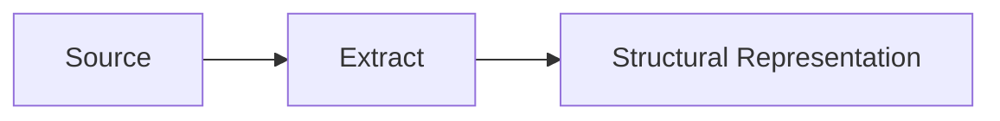
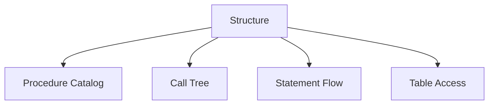
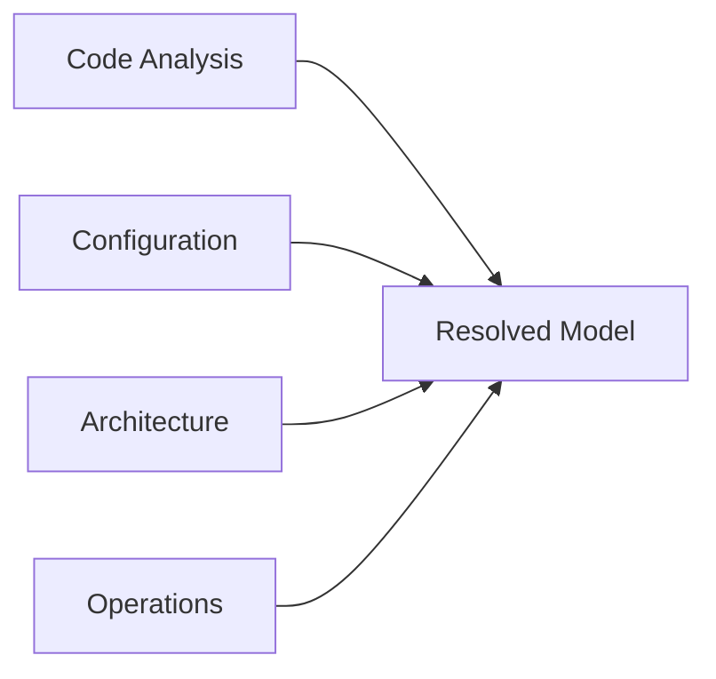
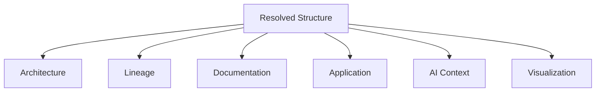
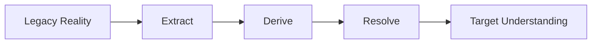

# Extract, Derive, Resolve, Publish
## A Story About Structure, Understanding, and the Reuse of Knowledge

### Introduction

Most organizations believe they suffer from a lack of information.

They do not.

They suffer from a lack of connected understanding.

Every day new information is created in source code, databases, application landscapes, process models, architecture repositories, configuration tables, spreadsheets, documentation, monitoring systems, and increasingly by artificial intelligence systems themselves.

Yet despite this abundance, simple questions often remain difficult to answer.

How does customer data move through the organization?

Which processes depend on a particular application?

What would break if a service is replaced?

Which systems support a business capability?

How does a legacy implementation relate to a modern target architecture?

The information required to answer these questions already exists. The challenge is that it exists in fragments.

This paper describes an approach that emerged from solving practical engineering problems rather than designing a grand theory. It began with parsers. It evolved into lineage analysis, architecture processing, graph construction, visualization, and ultimately a broader understanding of how structure itself can become a reusable organizational asset.

The central idea is remarkably simple:

```text
Extract
  ↓
Derive
  ↓
Resolve
  ↓
Publish
```

Everything else is a consequence.

---

# The Structural Foundation

At the foundation sits [XDM](https://www.w3.org/TR/xpath-datamodel-31/), the XML Data Model, together with XSD as a type system.

The important observation is that XDM is not merely about XML. Hierarchies, maps, lists, values, namespaces and references can all be represented within the model.

A compact Lisp-inspired serialization called S‑XDM can represent the same structure with less syntactic repetition.

```xml
<customer id="123">
  <name>John</name>
</customer>
```

```lisp
(customer
  {id 123}
  (name "John"))
```

The structure remains identical. Only the notation changes.

---

# Extraction

Extraction captures structure from existing sources.



The source may be code, databases, APIs, architecture repositories, configuration stores, or analytical systems.

The purpose is not yet understanding.

The purpose is faithful representation.

---

# Derivation

Once structure exists, additional knowledge can be derived.

A SQL codebase may produce:

- Procedure catalogs
- Call trees
- Statement flows
- Table access maps
- Dependency models



Derivation creates semantic artifacts that did not explicitly exist in the source.

---

# Resolution

Resolution is the process of connecting independently derived structures.

Many relationships are not present in source code.

Transfer configurations may exist in control tables.

Application ownership may exist in architecture repositories.

Runtime behavior may appear only in operational systems.



Individual stitching operations create relationships.

Collectively they produce a resolved understanding.

Graph databases become useful here because they provide an environment for relationship resolution rather than merely storage.

---

# Publication

Once understanding exists, it can be published.

Publication is broader than visualization.



Different audiences receive different perspectives derived from the same underlying structure.

---

# Viewpoints

Developers, analysts, architects, managers and AI systems all view reality through different lenses.

Developers see procedures, APIs and data structures.

Business analysts see processes and capabilities.

Managers see ownership, risk and value streams.

The underlying structure remains the same.

The publication changes.

---

# Reengineering

Traditional modernization often begins with interpretation.

A structural approach begins with evidence.



The objective becomes understanding behavior, dependencies, ownership and flow before selecting a target implementation.

---

# Observability

Observability enriches the model with runtime evidence.

The result is not only a model of what should happen.

It becomes a continuously validated representation of what actually happens.

---

# Human and Artificial Intelligence

Humans and AI consume different publications.

Humans prefer diagrams, narratives and abstractions.

AI systems prefer explicit structure, relationships and context.

Both benefit from the same resolved foundation.

The difference lies in publication rather than representation.

---

# Architecture and Art

Architecture and art appear very different.

Yet both can be viewed as publications of understanding.

Architecture publishes understanding for action.

Art publishes understanding for perception.

Both reveal structure.

---

# Conclusion

Over time a common pattern emerges:

```text
Extract
  ↓
Derive
  ↓
Resolve
  ↓
Publish
```

Applications, diagrams, reports, AI systems, lineage models, observability platforms and visualizations become publications of a deeper understanding.

The enduring asset is not the application, diagram, graph or report.

The enduring asset is the continuously derived and continuously resolved understanding from which all of them can be published.
