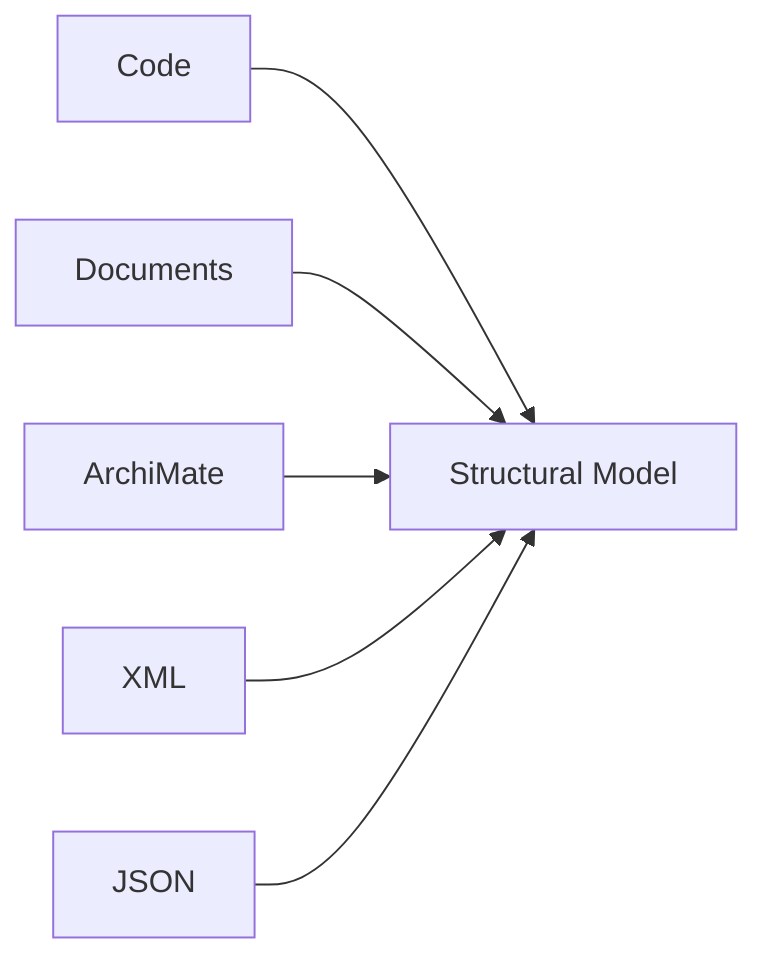
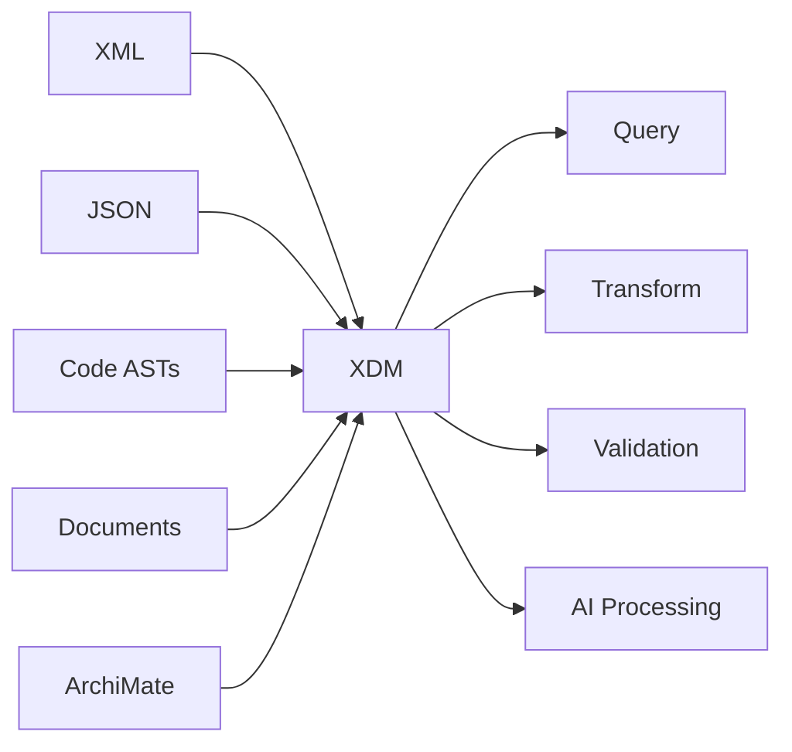
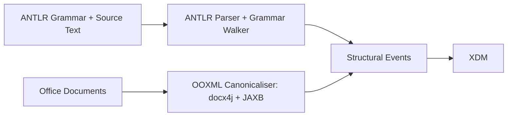
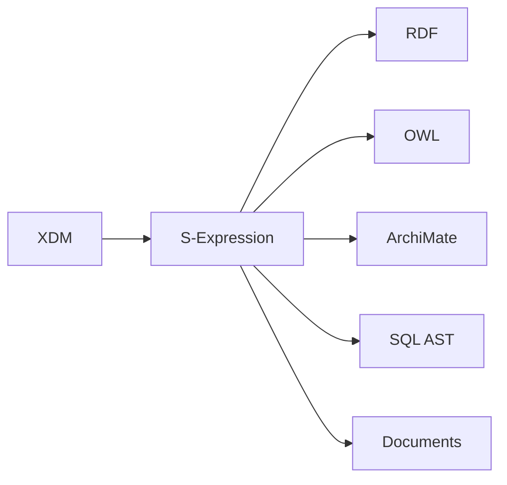
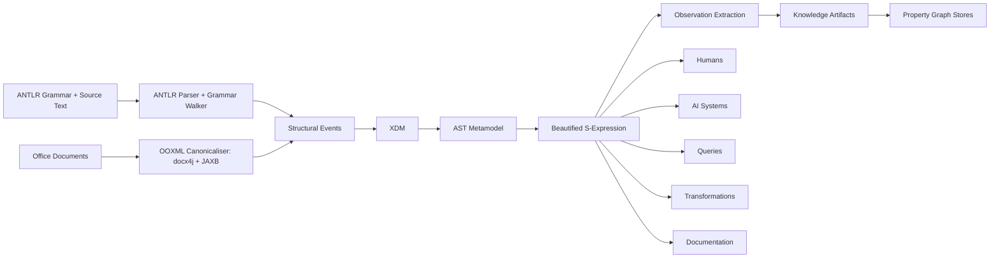
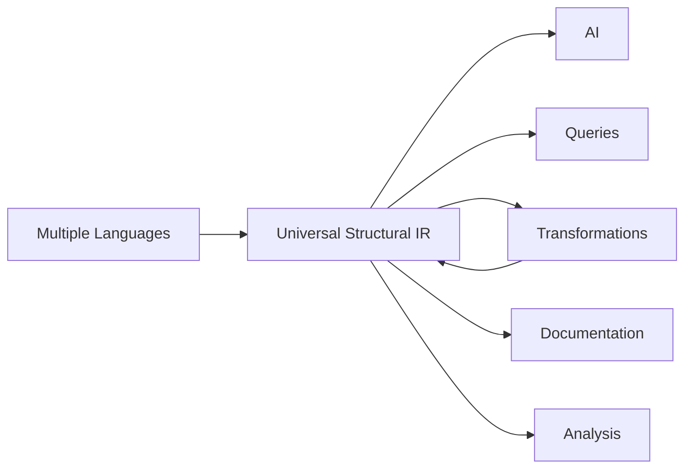

# Toward a Universal Knowledge Intermediate Representation

## XDM, AST Metamodels, and S-Expressions for Human and AI Consumption

**Jurgen Hildebrand (Concept Paper)**

## Abstract

The rapid growth of software systems, enterprise architectures, knowledge models, and AI-driven analysis has created a proliferation of incompatible representation formats. Programming languages use Abstract Syntax Trees (ASTs), business analysts use ArchiMate models, document systems use XML, APIs use JSON, and semantic systems use RDF/OWL.

This paper proposes a Universal Knowledge Intermediate Representation (UKIR) built upon the XQuery and XPath Data Model (XDM), generated through interchangeable source parser adapters. Adapters can be grammar-driven pipelines (for example ANTLR parser + grammar walker) or dedicated canonicalisation pipelines (for example OOXML canonicalisers built with `docx4j` + `JAXB`). The model is serialized using a beautified S-expression syntax that preserves structural fidelity while minimizing syntactic overhead. The approach leverages existing XML technologies such as XPath, XQuery, XSLT, XML Schema, and Schematron while providing a representation that is compact, machine-friendly, human-readable, and AI-friendly. The primary motivation is to produce deterministic, graph-ready knowledge artifacts that can be loaded into property graph stores for downstream reasoning and analytics.

## 1. Introduction

Many information domains are represented using different syntaxes:

- Java, C#, Python, SQL, PL/SQL
- XML and JSON documents
- BPMN and ArchiMate models
- Business specifications and enterprise documentation
- _RDF and OWL ontologies_

Despite their differences, most ultimately encode structured information.

The central thesis of this paper is:

> Many knowledge domains can be projected onto a common structural representation while preserving their semantics.

This structural projection is designed to separate deterministic evidence extraction from interpretation so downstream pipelines can construct higher-quality knowledge artifacts for property graph stores.

## 2. Representation Challenges

### XML

XML offers:

- Strong structural modeling
- Namespaces
- Mature validation technologies
- Query and transformation ecosystems

However, XML introduces syntactic redundancy.

```xml
<customer>
    <name>John</name>
</customer>
```

### JSON

JSON reduces verbosity but lacks many capabilities of the XML ecosystem.

### YAML

YAML improves readability but introduces parser complexity, indentation semantics, anchors, aliases, and ambiguity.

### RDF/OWL

RDF(S) and OWL provide formal semantics and reasoning capabilities.

However, they also introduce substantial conceptual complexity:

- Classes
- Individuals
- Restrictions
- Description Logic
- Open World Assumption
- Reasoners

## 3. Structure First

Rather than focusing on syntax, the proposed approach focuses on structure.



The syntax becomes secondary.

The structure becomes primary.

## 4. XDM as Canonical Model

The proposal uses XDM as the canonical representation.

XDM provides:

- Nodes
- Elements
- Attributes
- Text nodes
- Typed values
- Namespaces
- Ordering semantics

It already serves as the foundation for:

- XPath
- XQuery
- XSLT
- Schematron



Office documents often require a dedicated canonicalisation route to preserve semantic fidelity for diagrams and formulas.
In this route, documents are parsed through format-aware canonicalisers and mapped into typed canonical XML first.
That canonical model is then projected into XDM as a structurally stable intermediate form.
This is implemented in practice by `gradle-ooxml-plugin` using `docx4j` + `JAXB`, including formula mapping and diagram evidence extraction.

## 5. Source Adapter Driven Knowledge Extraction

Source parser adapters are treated as interchangeable front ends.
ANTLR grammars remain one important adapter class, but they are not a mandatory source route.



Adapter pipelines normalize source-specific constructs into structural events.

## 6. AST Metamodels

Raw ASTs remain language-specific.

AST instance:

```lisp
(SelectStatement
    (ColumnReference name)
    (TableReference customer))
```

AST metamodel:

```text
SelectStatement
 ├─ columns : ColumnReference*
 ├─ from    : TableReference+
 └─ where   : Predicate?
```

Benefits:

- Explicit semantics
- Navigation
- Validation generation
- Documentation generation
- AI reasoning support

## 7. Inferring Metamodels from Grammars

This mapping targets ANTLR-based extraction tracks.
Non-grammar tracks (for example Office canonicalisation with `JAXB` model mapping) derive metamodel elements from canonical model types instead of grammar operators.

Proposed mappings:

| ANTLR Construct | Metamodel Construct |
|----------------|--------------------|
| Parser Rule | Node Type |
| Lexer Rule | Primitive Type |
| ? | 0..1 |
| * | 0..N |
| + | 1..N |
| Alternatives | Inheritance |
| Labels | Property Names |

Example:

```antlr
assignment
  : target=identifier
    '='
    value=expression
  ;
```

Metamodel:

```text
Assignment
 ├─ target : Identifier
 └─ value  : Expression
```

## 8. Beautified S-Expressions

Example:

```lisp
(customer
    (name "John"))
```

Characteristics:

- Minimal syntax
- Trivial parser implementation
- Direct tree representation
- High semantic density
- Suitable for both humans and AI systems

## 9. Semantic Density

Semantic density is defined as:

> The proportion of tokens that carry meaning.

XML:

```xml
<name>John</name>
```

S-expression:

```lisp
(name "John")
```

Advantages:

- More information per context window
- Reduced syntactic overhead
- Better signal-to-noise ratio
- More efficient AI consumption

## 10. AI-Oriented Knowledge Representation

Large Language Models perform best when information exhibits:

- Explicit hierarchy
- Regular structure
- Low ambiguity
- High semantic density

Example:

```lisp
(UpdateStatement
    (TargetTable emp)
    (Assignment sal 1000)
    (Predicate (= empno 1)))
```

The parser has already performed most of the syntactic interpretation.

The AI can focus on reasoning.

## 11. RDF and OWL Compatibility

The proposed architecture does not exclude RDF(S) or OWL.

Namespaces remain available.

```lisp
(rdf:Description [xmlns:rdf http://www.w3.org/1999/02/22-rdf-syntax-ns#]
    (rdf:type Customer)
    (rdf:name "John"))
```



RDF and OWL become optional semantic layers rather than mandatory foundations.

## 12. Universal Knowledge Intermediate Representation



Parser adapter becomes ingestion boundary.

The metamodel becomes the semantic layer.

XDM becomes the canonical representation.

Beautified S-expressions become the universal readable notation.

### 12.1 Reference Implementation in Plugin Ecosystem

The current reference implementation realizes this architecture through four cooperating modules: `xml-sax-sexpr` provides `SExpressionParser`, `SExpressionXmlReader`, and `SExpressionSerializer`; `gradle-xml-plugin` routes `.xml` and `.sexpr` inputs into the same SAX/JAXP transformation and validation pipeline; `gradle-antlr-plugin` supplies grammar-driven structural extraction; and `gradle-ooxml-plugin` supplies Office canonicalisation (`docx4j` + `JAXB`) for high-fidelity formula and diagram capture.

Processing parity is explicit: S-expression is an alternate syntax that is normalized into SAX/JAXP events before downstream processing, so processors such as Saxon receive equivalent event streams and therefore apply XSD type processing and XML pipeline behavior exactly as in the native XML route.

Current implementation boundary is the SAX event layer (including mapping from S-expression to internal `xdm:*` bridge events where required); an XProc-native integration is a possible future extension point, but there is no active plan to move processing responsibility there.

Canonical JSON is supported in `gradle-xml-plugin` as an optional sibling serialization path for selected workflows, while XML/XDM and S-expression remain the primary structural route in this architecture.

## 13. Conclusion

The proposed architecture combines:

1. XDM as a canonical structural model
2. Adapter-driven normalization
3. Automatic AST metamodel generation
4. Beautified S-expression serialization
5. Compatibility with existing XML infrastructure
6. AI-oriented semantic density

Conceptually, the architecture resembles a knowledge-oriented analogue of LLVM:



# Related Work

## References

1. Kiselyov, O. (2002)  
   **SXML Specification**  
   Introduces SXML, a complete S-expression representation of the XML Information Set, enabling XML documents to be processed as native tree structures in Scheme while preserving round-trip compatibility with XML.
   URL: https://doi.org/10.1145/571727.571736

2. Kiselyov, O., & Lisovsky, K. (2002)  
   **XML, XPath, XSLT Implementations as SXML, SXPath, and SXSLT**  
   Presents a complete XML processing stack built on SXML, including XPath querying and XSLT-style transformations over S-expression representations of XML documents.
   URL: https://okmij.org/ftp/papers/SXs.pdf

3. World Wide Web Consortium (W3C)  
   **XQuery and XPath Data Model (XDM)**  
   Defines the formal data model underlying XPath, XQuery, and XSLT. Introduces a unified representation of documents, elements, attributes, namespaces, and typed values.
   URL: https://www.w3.org/TR/xpath-datamodel/

4. World Wide Web Consortium (W3C)  
   **XML Path Language (XPath) 3.1 Recommendation**  
   Defines a declarative navigation and query language for traversing and selecting nodes within the XDM data model.
   URL: https://www.w3.org/TR/xpath-31/

5. World Wide Web Consortium (W3C)  
   **XQuery 3.1: An XML Query Language**  
   Defines a functional query language operating over XDM, enabling complex transformations, querying, and construction of structured data.
   URL: https://www.w3.org/TR/xquery-31/

6. World Wide Web Consortium (W3C)  
   **XSL Transformations (XSLT) Version 3.0**  
   Specifies a declarative transformation language for converting, restructuring, and generating XML and XDM-based representations.
   URL: https://www.w3.org/TR/xslt-30/

7. Parr, T. (2013)  
   **The Definitive ANTLR 4 Reference**  
   Comprehensive guide to ANTLR 4, covering grammars, parser generation, parse trees, visitors, listeners, and language engineering techniques.
   URL: https://pragprog.com/titles/tpantlr2/the-definitive-antlr-4-reference/

8. Fowler, M. (2010)  
   **Domain-Specific Languages**  
   Explores techniques for designing, implementing, and maintaining domain-specific languages using textual and graphical representations.
   URL: https://martinfowler.com/books/dsl.html

9. Völter, M. (2013)  
   **DSL Engineering: Designing, Implementing and Using Domain-Specific Languages**  
   Covers language workbenches, grammar-to-model mappings, projectional editing, metamodeling, and DSL architectures.
   URL: https://dslbook.org/

10. Object Management Group (OMG)  
    **Meta Object Facility (MOF) Core Specification**  
    Defines a standardized metamodeling architecture used as the foundation for UML, BPMN, and many model-driven engineering frameworks.
    URL: https://www.omg.org/spec/MOF/

11. Object Management Group (OMG)  
    **Unified Modeling Language (UML) Specification**  
    Defines a standardized modeling language for representing software structures, behaviors, relationships, and system architectures.
    URL: https://www.omg.org/spec/UML/

12. The Open Group  
    **ArchiMate® Specification**  
    Defines a modeling language for enterprise architecture covering business, application, technology, and strategy layers.
    URL: https://www.opengroup.org/archimate-forum/archimate-overview

13. Wikipedia Contributors  
    **Abstract Syntax Tree**  
    Describes ASTs as abstract structural representations of source code and formal languages, widely used in compilers, analysis, and transformation systems.
    URL: https://en.wikipedia.org/wiki/Abstract_syntax_tree

14. World Wide Web Consortium (W3C)  
    **RDF 1.1 Concepts and Abstract Syntax**  
    Defines the Resource Description Framework data model, including resources, literals, IRIs, triples, graphs, and semantic interoperability.
    URL: https://www.w3.org/TR/rdf11-concepts/

15. World Wide Web Consortium (W3C)  
    **OWL 2 Web Ontology Language Document Overview**  
    Introduces OWL as a knowledge representation language for defining ontologies, logical relationships, constraints, and reasoning models.
    URL: https://www.w3.org/TR/owl2-overview/

16. Sun, W., Fang, C., Miao, Y., You, Y., Yuan, M., Chen, Y., Zhang, Q., Guo, A., Chen, X., Liu, Y., & Chen, Z. (2023)  
    **Abstract Syntax Tree for Programming Language Understanding and Representation: How Far Are We?**  
    Surveys AST-based techniques for code representation learning, software engineering tasks, program understanding, and AI-assisted code analysis.
    URL: https://arxiv.org/abs/2312.00413

17. Yu, Y., Beyls, K., & D'Hollander, E.H. (2004)  
    **Performance Visualizations Using XML Representations**  
    Investigates XML-based intermediate representations as a mechanism for exchanging compiler information, ASTs, optimization metadata, and analysis results.
    URL: https://doi.org/10.1109/IPDPS.2004.1303000
    IEEE: https://ieeexplore.ieee.org/document/1320231
18. He, J., Rungta, M., Koleczek, D., Sekhon, A., Wang, F.X., Hasan, S.
    **Does Prompt Formatting Have Any Impact on LLM Performance?** (2024)  
    Studies the effect of prompt representations (plain text, Markdown, JSON, YAML) on LLM performance. Reports measurable format sensitivity, particularly for smaller models.  
    URL: https://arxiv.org/abs/2411.10541  【1-dcd702】【2-a00800】

19. Kulmizev, A., Nivre, J.  
    **Schrödinger's Tree: On Syntax and Neural Language Models** (2022)  
    Survey of research on syntactic structure in neural language models and how hierarchical representations emerge from sequence-based training.  
    URL: https://pmc.ncbi.nlm.nih.gov/articles/PMC9618648/  【3-d89703】【4-e5b907】

20. Shen, D., Chen, X., Wang, C., Sen, K., Song, D.  
    **Benchmarking Language Models for Code Syntax Understanding** (EMNLP Findings 2022)  
    Introduces the CodeSyntax benchmark and shows that pretrained code models often exhibit weaker syntactic understanding than commonly assumed.  
    URL: https://arxiv.org/abs/2210.14473  【5-b38fcb】【6-efae7e】

21. Troshin, S. et al.  
    **AST-Probe: Recovering Abstract Syntax Trees from Hidden Representations of Pre-trained Language Models** (ASE 2022)  
    Demonstrates that AST information can be recovered from internal model representations, suggesting that syntax is encoded in latent space.  
    URL: https://doi.org/10.1145/3551349.3556900  【7-5964e1】

22. Sun, W. et al.  
    **Abstract Syntax Tree for Programming Language Understanding and Representation: How Far Are We?** (2023)  
    Comprehensive survey of AST-based approaches for code representation learning and program understanding.  
    URL: https://arxiv.org/abs/2312.00413  【8-74f013】

23. Strobl, L., Merrill, W., Weiss, G., Chiang, D., Angluin, D.  
    **What Formal Languages Can Transformers Express? A Survey** (TACL 2024)  
    Formal-language-theoretic analysis of transformer expressiveness, including limitations on nested and recursive structures under realistic assumptions.  
    URL: https://arxiv.org/abs/2311.00208  
    URL: https://direct.mit.edu/tacl/article/doi/10.1162/tacl_a_00663  

24. Hildebrand, J.S  
    **gradle-ooxml-plugin README**  
    Documents dedicated Office canonicalisation route (`.docx/.pptx/.xlsx`) using `docx4j` + `JAXB`, formula mapping to MathML, and diagram/graph evidence extraction for deterministic structural output.  
    Path: gradle-ooxml-plugin/README.md](../../gradle-ooxml-plugin/README.md)

25. Hildebrand, J.S  
    **Technical Design - gradle-ooxml-plugin**  
    Specifies architecture and canonical data model details for OOXML canonicalisation, including chart and GraphML diagram evidence mapped into canonical XML.  
    Path: [gradle-ooxml-plugin/doc/TECHNICAL_DESIGN.md](https://github.com/jurgenei/gradle-ooxml-plugin/doc/TECHNICAL_DESIGN.md)

26. Hildebrand, J.S  
    **gradle-antlr-plugin README**  
    Documents ANTLR-based grammar walker
    Path: [gradle-antlr-plugin/README.md](https://github.com/jurgenei/gradle-antlr-plugin/README.md)

27. Hildebrand, J.S  
    **xml-sax-sexpr README**  
    Documents SAX parser/serializer/XMLReader support for canonical S-expression syntax, including `xdm:map`, `xdm:array`, typed atomics, and bridge namespace rules.
    Path: [xml-sax-sexpr/README.md](https://github.com/jurgenei/xml-sax-sexpr/README.md)

28. Hildebrand, J.S
    **S-XDM implementation specification**
    Path: [S-XDM-Implementation-Spec.md](S-XDM-Implementation-Spec.md)


