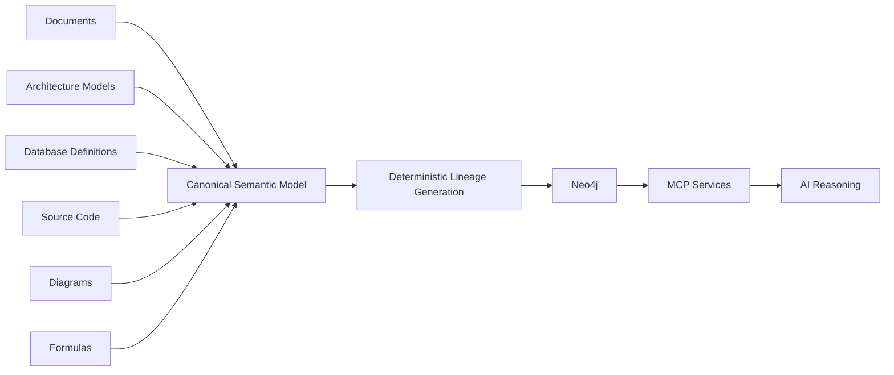
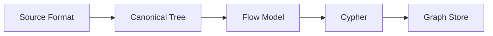
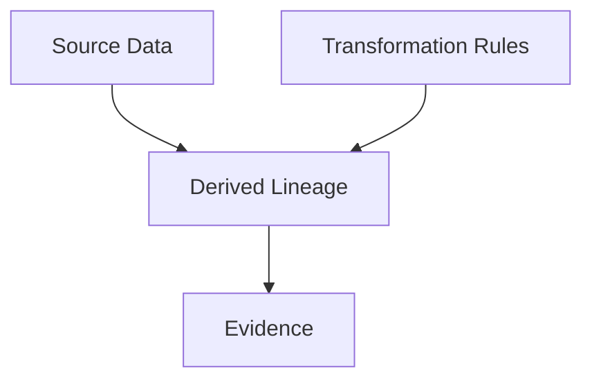
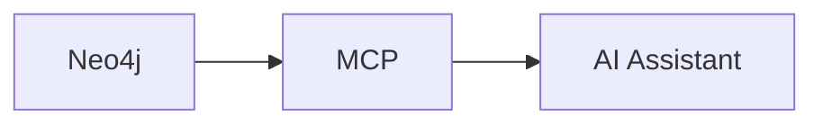

# Universal Semantic Lineage Architecture

## 1. Introduction: Better Reasoning, Lower Cost, Reproducibility, and ESG

Organizations increasingly rely on artificial intelligence to understand software systems, data platforms, business processes, technical documents, architecture models, and operational environments. A common problem is that most information exists in many different formats and tools. Database definitions, documents, architecture diagrams, formulas, source code, and metadata are stored separately and expressed in different languages.

The prevailing approach is to expose these artifacts directly to AI models and ask the models to infer meaning. While this can produce useful results, it has several drawbacks. The same question may yield different answers over time. Large context windows are required. Significant amounts of text must be transmitted to a model repeatedly. Costs increase, energy consumption increases, and reproducibility suffers.

This paper proposes an alternative approach. Instead of using AI to discover structure at runtime, structure is extracted deterministically before AI is involved. Information from many sources is normalized into a common semantic representation. Lineage and dependencies are derived through deterministic transformations and stored in a graph database. AI is then used only for navigation, explanation, impact analysis, and reasoning on top of proven facts.

This architecture delivers several strategic objectives.

First, it reduces token consumption. Repetitive structural information is represented once in a schema rather than repeated throughout operational data.

Second, it improves reasoning quality. AI receives explicit semantics instead of reconstructing them through inference.

Third, it enables the use of smaller and cheaper models because much of the reasoning has already been compiled into graph structures.

Fourth, it improves reproducibility and auditability. The same source material always produces the same lineage graph.

Fifth, it contributes to ESG objectives by reducing computational waste, lowering energy usage, and decreasing infrastructure costs.

In essence, computational effort is moved from expensive runtime AI reasoning to deterministic compile-time semantic processing.

---

## 2. The Core Problem

Modern organizations operate numerous information domains simultaneously.

A single business capability may be described in:

- architecture repositories
- databases
- reports
- spreadsheets
- technical documentation
- formulas
- diagrams
- software source code

Each source contains part of the truth.

Traditional tooling treats each domain separately. Architecture tools analyze architecture. Database tools analyze databases. Documentation systems analyze documents.

As a result, relationships between domains become difficult to discover and expensive to maintain.

The objective of the proposed architecture is to create a single semantic view capable of describing all these domains in a consistent manner.

---

## 3. Architectural Overview

The proposed architecture transforms heterogeneous information into a common semantic representation before loading it into a graph database.



The key design principle is that AI consumes lineage rather than generates lineage.

---

## 4. Semantic Normalization

Different source formats often describe similar concepts.

A business process in an architecture model, a workflow in a document, and an implementation in software may all describe the same business capability.

Before analysis can occur, these formats are normalized into a common semantic model.

The architecture therefore introduces a canonical representation.

Rather than preserving every implementation detail of every source format, the system focuses on concepts such as:

- entities
- relationships
- transformations
- dependencies
- references
- containment

This reduction significantly increases information density.

The canonical model acts as an intermediate semantic language shared by all source systems.

---

## 5. Schema-Driven Semantics

A central observation is that structural rules are often repeated many thousands of times.

Instead of repeating those rules in every instance, they are stored once in a schema representation.

The architecture introduces a "quiplet".

A triplet traditionally consists of:

```text
(subject, predicate, object)
```

A quiplet extends this with structural semantics:

```text
(subject, predicate, object, cardinality)
```

Example:

```text
(Customer, owns, Account, 1:N)
```

The critical design decision is that quiplets exist only at schema level.

Operational data remains compact:

```text
(Jan, owns, Account123)
(Jan, owns, Account124)
```

The schema provides context while the instance data remains lightweight.

This separation maximizes information density while minimizing token consumption.

---

## 6. Canonical Trees Instead of Immediate Graphs

Many source formats naturally represent information as trees.

Documents form trees.

Architecture models serialized in XML form trees.

Language parsers produce trees.

Instead of immediately forcing data into graph structures, the architecture preserves information in a canonical tree representation during transformation.



Working with trees during transformation provides deterministic processing and significantly simplifies implementation.

Only the final result is projected into a graph database.

---

## 7. Compact Semantic Representation

The runtime representation is intentionally compact.

Instead of verbose XML being passed into AI contexts, tree structures can be represented using a concise symbolic notation.

For example:

```text
(Application
   (Service CustomerPortal)
   (Service ReportingService))
```

This representation preserves hierarchy while dramatically reducing syntactic overhead.

As a result, more business knowledge fits into a single context window.

The architecture therefore acts as a semantic compression mechanism.

---

## 8. Deterministic Lineage Derivation

The primary objective is not graph storage.

The primary objective is deterministic lineage.

Lineage is generated through explicit transformation rules.

Every derived relationship can be traced back to:

- source artifact
- transformation rule
- version
- evidence



This allows complete reproducibility.

Given identical inputs and identical transformation rules, identical lineage is produced.

This characteristic is essential in regulated environments.

---

## 9. BCBS239 Alignment

Financial institutions are expected to demonstrate traceability and reproducibility of information.

A lineage graph derived by deterministic transformations is much easier to audit than a lineage graph generated by probabilistic AI behavior.

The proposed architecture therefore treats AI as a consumer of verified knowledge rather than as a producer of governance-critical metadata.

This separation helps satisfy requirements related to transparency, traceability, and repeatability.

---

## 10. Neo4j as the Knowledge Layer

After lineage has been derived, it is serialized into Cypher and loaded into Neo4j.

Neo4j becomes the operational knowledge layer.

Typical graph traversals include:

- impact analysis
- dependency analysis
- data flow navigation
- business capability lineage
- report tracing

The graph database stores the results of semantic compilation rather than raw source documents.

---

## 11. MCP as the Access Layer

An MCP layer exposes the graph to AI systems.



The AI can answer questions such as:

"Which reports are affected if this column changes?"

"Which business capabilities depend on this application?"

"Which formulas contribute to this metric?"

The difficult analytical work has already been performed before the query reaches the AI model.

---

## 12. Why This Improves AI Reasoning

AI systems perform best when facts are explicit.

They perform less reliably when facts must be reconstructed from large amounts of raw information.

The proposed architecture increases reasoning quality because:

- semantics are explicit
- structure is normalized
- redundancy is removed
- lineage is precomputed
- context windows contain facts instead of raw source material

Consequently, models spend less effort interpreting structure and more effort answering questions.

---

## 13. Cost Reduction and ESG Benefits

Most AI cost originates from repeatedly processing the same information.

The architecture reduces cost in three ways.

First, semantic normalization compresses information.

Second, lineage is computed once and reused many times.

Third, smaller models become viable because the architecture supplies explicit semantics.

Less computation means:

- lower inference cost
- lower infrastructure cost
- lower energy consumption
- lower carbon footprint

These benefits support both financial and ESG objectives.

---

## 14. Roadmap and Future Work

The architecture intentionally delays the creation of a rigid global ontology.

Experience suggests that ontologies become stronger after significant amounts of real operational data have been analyzed.

The recommended evolution is:

1. stabilize the semantic schema model
2. normalize multiple source domains
3. generate lineage
4. populate the graph
5. observe real usage patterns
6. refine the semantic ontology

This allows the ontology to emerge from evidence rather than speculation.

---

## 15. Conclusion

The proposed architecture introduces a deterministic semantic compilation pipeline capable of transforming heterogeneous information sources into a single reproducible knowledge graph.

By separating schema knowledge from operational instances, using compact semantic representations, generating lineage deterministically, and exposing validated knowledge through graph technology and MCP, the architecture improves reasoning quality while simultaneously reducing token usage, infrastructure cost, and energy consumption.

Rather than asking AI to discover structure repeatedly, the architecture discovers structure once and makes the results permanently available. This shift from runtime inference to semantic compilation provides the foundation for scalable, auditable, explainable, and ESG-conscious enterprise intelligence.
