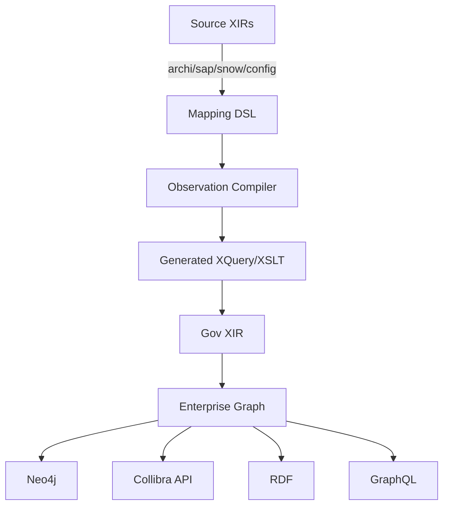
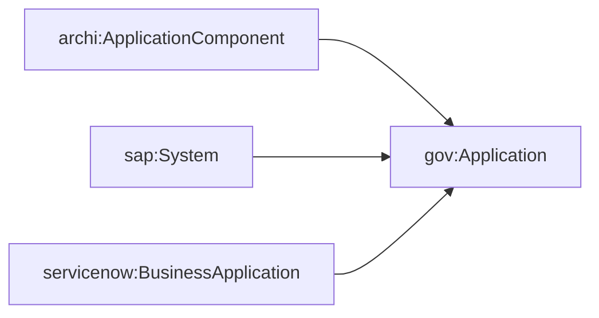
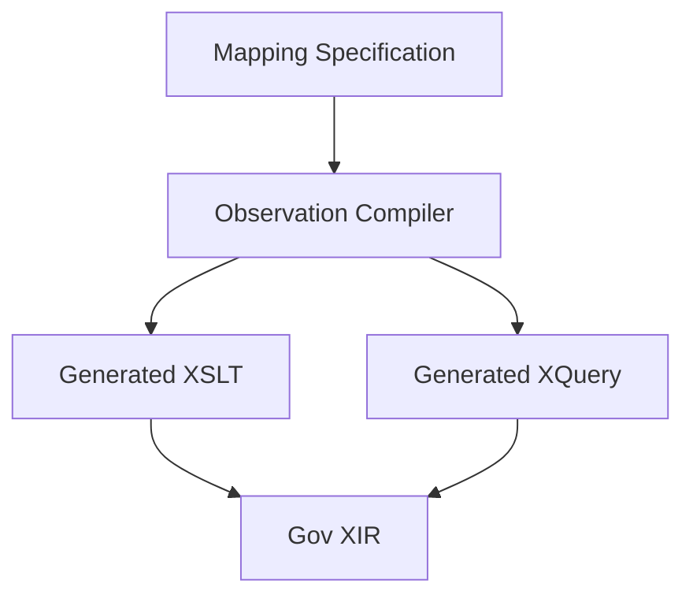
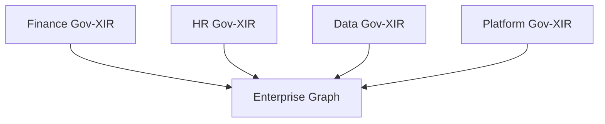
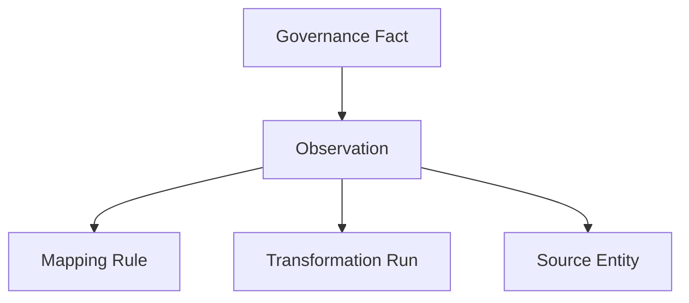
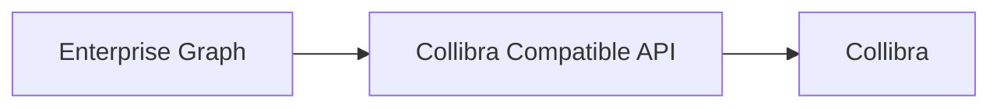

# Evidence-Oriented Enterprise Knowledge Graph Federation using XIR

## Abstract

Enterprise governance initiatives frequently struggle with three interconnected problems: semantic fragmentation, vendor lock-in, and regulatory traceability. Metadata from architecture repositories, configuration sources, CMDBs, databases, APIs, and source code is commonly integrated directly into governance platforms through bespoke mappings. The resulting governance assets often lack explicit evidence describing how they were derived.

This paper proposes an evidence-oriented architecture based on XIR, namespace-oriented ontology alignment, governance normalization, compiled observations, and enterprise graph federation. Source vocabularies are preserved in their native namespaces, normalized through declarative mapping specifications, compiled into executable XQuery/XSLT transformations, and federated into a canonical governance ontology. The resulting enterprise graph stores not only governance facts but also the evidence, rules, and transformations that produced those facts.

The approach supports lineage, traceability, BCBS239-style auditability, platform independence, and projection into Neo4j, Collibra-compatible APIs, RDF, GraphQL, and other consumers.

---

# 1. Introduction

Enterprise metadata landscapes are inherently heterogeneous.

Examples include:

- ArchiMate models
- ServiceNow CMDBs
- SAP landscapes
- Configuration repositories
- Database catalogs
- API specifications
- Source code repositories

Each domain introduces its own terminology, identifiers, hierarchies, and relationships.

Traditional governance architectures typically perform direct mappings into a governance platform:

```text
Source System
      ↓
Vendor Mapping
      ↓
Governance Tool
```

This creates several challenges:

- Governance semantics become vendor-specific.
- Mappings are difficult to audit.
- Semantic equivalence is implicit.
- Migration to another governance platform is expensive.
- Traceability is reconstructed rather than modeled.

This paper proposes an alternative architecture where governance facts are derived from explicit observations, mappings, and evidence.

---

# 2. Design Principles

## 2.1 Separate Source Semantics from Governance Semantics

Every source retains its own namespace.

```text
archi:
sap:
servicenow:
config:
ddl:
```

The enterprise owns a canonical namespace.

```text
gov:
```

The governance namespace represents enterprise-wide concepts.

Examples:

```text
gov:Application
gov:Dataset
gov:Database
gov:Consumes
gov:Produces
gov:Owns
```

---

## 2.2 Treat Mappings as Governed Assets

Mappings are not implementation details.

Mappings represent semantic decisions.

Example:

```text
sap:System
        ≡
gov:Application
```

Such decisions should be versioned, governed, queryable, and auditable.

---

## 2.3 Treat Evidence as First-Class Information

A governance fact alone is insufficient.

Instead of storing:

```text
Application(CRM)
```

the platform stores:

```text
Application(CRM)
      ↓
Derived From Observation
      ↓
Generated By Rule
      ↓
Executed During Transformation
      ↓
Observed In Source System
```

---

# 3. Architectural Overview



The enterprise graph becomes the canonical model.

Consumers become projections.

---

# 4. XIR as the Common Representation

XIR acts as a common semantic representation capable of describing:

- Source information
- Governance ontology
- Mapping specifications
- Observations
- Provenance

Example:

```xir
(sap:System
  {id "CRM"}
  (sap:Name "Customer Relationship Management"))
```

Normalized result:

```xir
(gov:Application
  {id "CRM"}
  (gov:Name "Customer Relationship Management"))
```

---

# 5. Namespace-Oriented Ontology Alignment

Every source namespace owns its own vocabulary.



The governance ontology is therefore decoupled from individual source systems.

---

# 6. Mapping DSL

The mapping layer expresses semantic equivalence.

Example:

```xir
(map:Type
  {source archi:ApplicationComponent
   target gov:Application})
```

Relation mapping:

```xir
(map:Relation
  {source sap:Uses
   target gov:Consumes})
```

Attribute mapping:

```xir
(map:Attribute
  {source owner
   target owner})
```

Identity mapping:

```xir
(map:Identity
  {attribute id})
```

The DSL communicates intent rather than implementation details.

---

# 7. Observation Compilation

The observation compiler acts as a semantic compiler.



The mapping author focuses on semantic alignment.

Executable transformation logic is generated automatically.

---

# 8. Governance Ontology

The governance vocabulary provides a canonical semantic model.

Example concepts:

```text
gov:Application
gov:Dataset
gov:Database
gov:Interface
gov:API
gov:BusinessCapability
```

Example relationships:

```text
gov:Consumes
gov:Produces
gov:Owns
gov:DependsOn
gov:Implements
```

The ontology becomes independent of any governance platform.

---

# 9. Enterprise Graph Federation

Each normalized Gov-XIR contributes to a larger enterprise graph.



Federation occurs through shared identities and governance semantics.

---

# 10. Provenance and Evidence Model

This section represents the primary contribution.

Governance facts must be explainable.

## 10.1 Evidence Chain



Every governance fact carries an evidence trail.

Example:

```text
Application(CRM)
```

can be explained by:

```text
Observed SAP System CRM
Using Rule ApplicationMapping-v7
Executed in Transformation Run 2026-09-29
Generated Governance Application CRM
```

---

# 11. BCBS239 Alignment

BCBS239 emphasizes:

- Accuracy
- Integrity
- Completeness
- Traceability
- Adaptability
- Auditability

The architecture supports these principles by storing:

1. Source observations
2. Transformation rules
3. Generated governance facts
4. Execution metadata
5. Provenance relationships

Auditors can reconstruct the complete derivation chain.

---

# 12. Neo4j Representation

The enterprise graph may be persisted in Neo4j.

Example:

```cypher
(:Application {id:'CRM'})
  -[:CONSUMES]->
(:Database {id:'CustomerDB'})
```

Provenance example:

```cypher
(:Application)
  -[:DERIVED_FROM]->
(:Observation)

(:Observation)
  -[:USED_RULE]->
(:Rule)
```

Neo4j therefore stores facts and evidence.

---

# 13. Collibra Compatibility Layer

Collibra is treated as a projection.



Benefits:

- Reduced vendor lock-in
- Easier migration
- Local emulation
- Consistent semantics

The governance ontology remains authoritative.

---

# 14. AI-Assisted Mapping Authoring

The mapping DSL is intentionally closer to business semantics than transformation semantics.

This enables:

```text
Architect
     ↓
Mapping Intent
     ↓
AI Generation
     ↓
Mapping Specification
     ↓
Observation Compiler
```

The reviewed artifact becomes the mapping specification rather than generated code.

---

# 15. Benefits

## For Executives

- Reduced governance platform lock-in
- Improved regulatory readiness
- Lower integration costs

## For Business Analysts

- Explicit business vocabulary
- Explainable mappings
- Consistent terminology

## For Developers

- Generated transformation logic
- Clear separation of concerns
- Reusable semantic model

## For Auditors

- End-to-end traceability
- Rule-level lineage
- Reconstructable evidence chains

---

# 16. Future Work

Potential extensions include:

- Native provenance namespace
- Bidirectional mappings
- RDF/OWL projections
- SHACL validation
- Semantic reasoning
- Automated ontology alignment
- Agent-assisted governance workflows

---

# 17. Conclusion

The architecture described in this paper evolved from a representation problem into an evidence-oriented governance architecture.

The key insight is that governance facts should not exist independently of the observations, mappings, and evidence that produced them.

By combining XIR, namespace-oriented ontology alignment, observation compilation, governance normalization, and enterprise graph federation, organizations can construct a portable, auditable, and explainable enterprise knowledge graph.

The resulting system stores not only the answer, but also the proof.
