<!-- FRONTMATTER.BEGIN -->
⬆️ [README](README.md) > continuous-architecture-reconcilliation
<!-- FRONTMATTER.END -->

# Continuous Architecture Reconciliation and Near-Reality Lineage
## Discussion Capture for Future Conversations

Author: Jurgen Hildebrand
Status: Working Architecture and Emerging Thought Leadership Material
Date: Thursday, 16 July 2026

---

> The assignment was to create a lineage solution. The investigation showed that lineage itself was not the hardest problem. The harder problem was continuously maintaining trust in lineage as systems evolve. The resulting architecture therefore focuses on continuously reconciling implementation reality and architectural intent, from which lineage, impact analysis and governance information are generated. The lineage objective is fulfilled, but in a way that remains sustainable as the system changes.
# 1. Problem Statement

Traditional approaches suffer from several structural issues:

- Architecture documentation drifts from implementation reality.
- Data lineage becomes stale.
- Impact assessments rely on expert knowledge and tribal knowledge.
- Root cause analysis is expensive and slow.
- Governance repositories are consumers of metadata rather than sources of truth.
- BCBS239 requires traceability, impact analysis, completeness and understanding of risk data flows.
- Existing lineage products focus on collecting, storing and visualizing lineage but do not reconcile architectural intent and implementation reality.

Core observation:

> Documentation decays. Derived knowledge ages much slower.

---

# 2. Scope

Current implementation scope is:

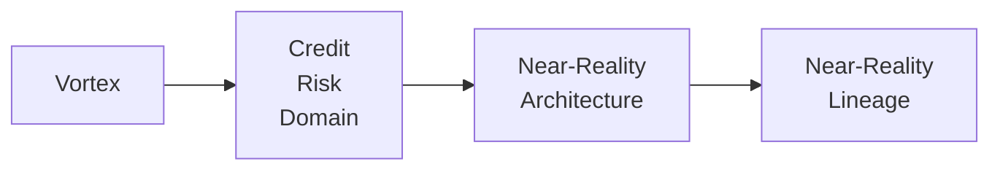

> This is NOT an enterprise-wide lineage platform.
> It is a reference implementation within a critical risk domain.

---

# 3. Architecture Philosophy

## Principle 1: Infer Everything Possible

If information can be derived from:

- source code
- configuration
- databases
- metadata
- ETL definitions
- deployment definitions

then it should be derived automatically.

Manual maintenance of inferable facts is technical debt.

---

## Principle 2: Model Only Non-Inferable Knowledge

ArchiMate contains only information that cannot be derived automatically.

Examples:

- ownership
- intended architecture
- conceptual mappings
- business semantics
- architectural decisions
- dynamic behavior that cannot be inferred
- reference-data-driven semantics
- organizational knowledge

Rule:

> If it can be inferred, don't model it.
> If it cannot be inferred, explicitly model it.

---

# 4. Near-Reality Lineage

Proposed definition:

> Near-reality lineage is a continuously reconciled lineage model derived from implementation artifacts and enriched with explicitly modeled non-inferable knowledge.

Alternative definition:

> Near-reality lineage is the closest practical representation of operational reality achievable through derivation and explicit modeling.

Important:

Near-reality lineage is NOT:

- perfect lineage
- purely static lineage
- purely runtime lineage
- manually curated lineage

Instead:

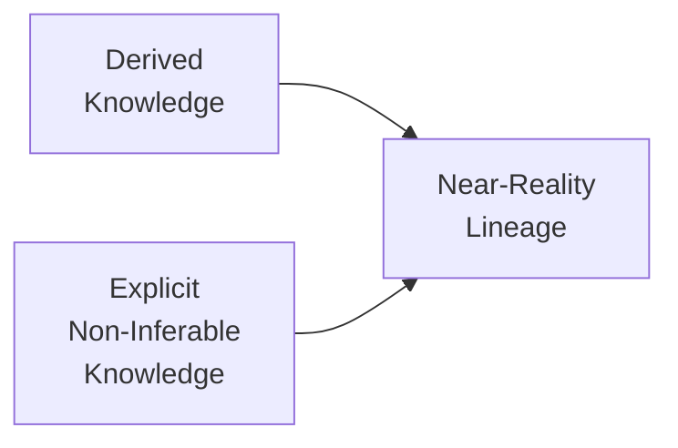
---

# 5. Canonical Graph Architecture

Actual architecture:


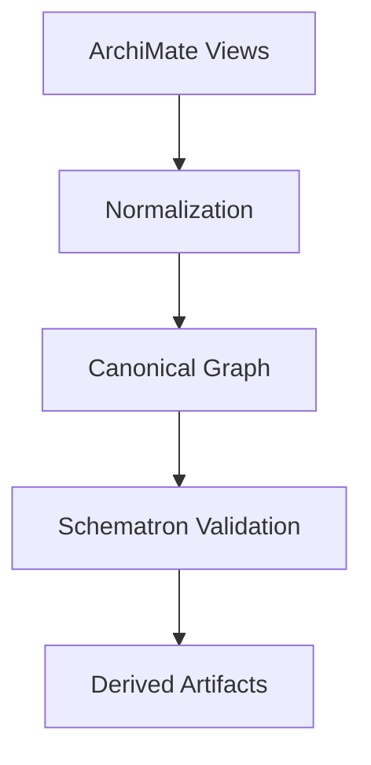

The important artifact is not the ArchiMate model itself.

The important artifact is:

```text
Canonical Enterprise Graph
```

All Archi views are merged.

Architecture metadata is normalized.

Relationships are consolidated.

This graph becomes the basis for:

- validation
- lineage
- impact analysis
- Collibra publication
- developer tooling

---

# 6. Compiler Analogy

The architecture behaves like a compiler.


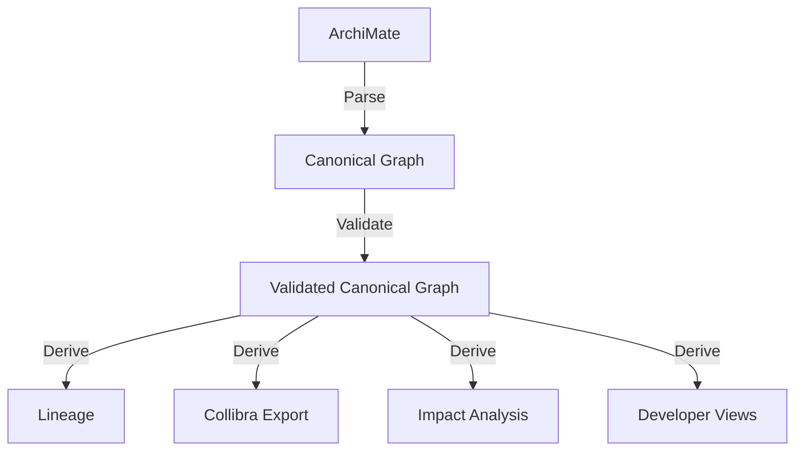

Observation:

This is closer to a compiler architecture than a traditional lineage platform.

---

# 6.1 Canonical IR Layering (Implementation Path)

Why:

- Reconciliation needs semantically stable inputs, not parser-specific syntax trees.
- Column lineage quality depends on alias/scope resolution before lineage extraction.

How:

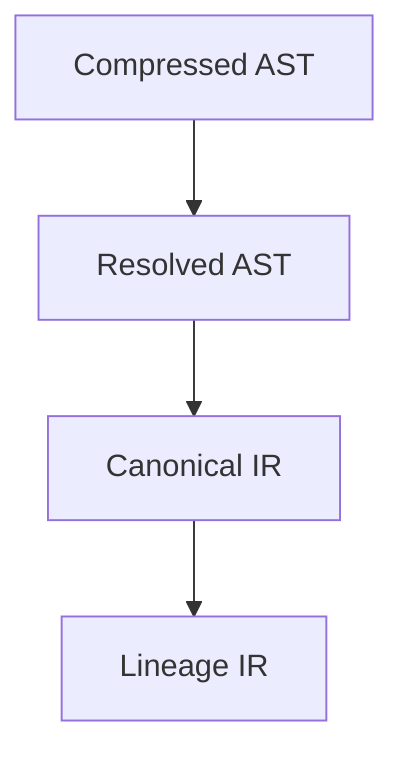

Canonical IR is the semantic bridge between parsing output and lineage extraction.

So what:

- transformation rules become testable at semantic boundaries
- confidence grading (`EXACT`, `INFERRED`, `UNKNOWN`) becomes consistent
- lineage derivation remains stable when SQL surface syntax varies

Reference specification:

- [Canonical IR Specification](../design/plsql-lineage-architecture-docs/02-canonical-ir-spec.md)

---

# 7. Schematron as Architecture Fitness Functions

Major insight:

Schematron is functioning as architecture fitness functions.

Concept:


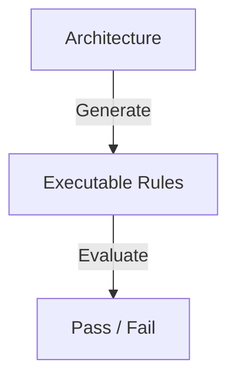

Examples:

- every application has an owner
- every interface connects valid components
- architectural constraints hold
- lineage completeness checks
- governance checks

Architecture becomes executable.

Not merely documented.

---

# 8. Architecture as Code

Analogy:

Traditional architecture:


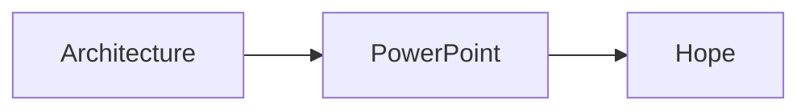
Architecture-as-Code:


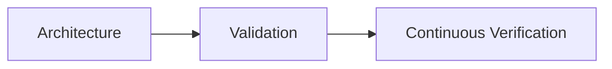

Equivalent to software:


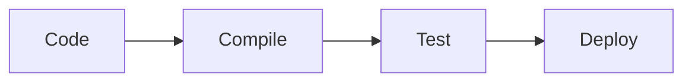
---

# 9. Continuous Reconciliation

The key architectural concept:


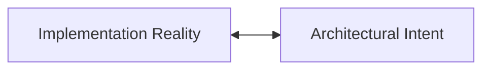
The platform continuously reconciles them.

Traditional lineage focuses on:

```text
Stored lineage
```

This platform focuses on:

```text
Re-derived lineage
```

---

# 10. Developer Use Case

The UI is not intended to replace Collibra.

Purpose:

```text
Developer Lineage Debugger
```

Target users:

- developers
- maintainers
- production support
- architects

Questions answered:

- What changed?
- What breaks?
- Who depends on this?
- Which path leads to this dataset?
- What is impacted?

The UI supports:

- root cause analysis
- impact analysis
- refinement work
- dependency navigation

Not business governance.

---

# 11. Role of Collibra

Collibra is not the source of truth.

Architecture:


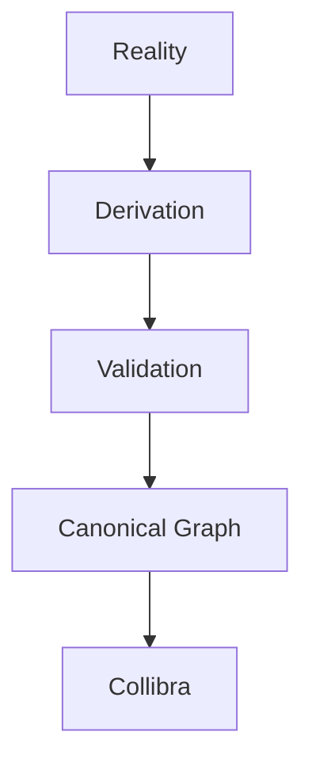

Collibra is a publication endpoint.

---

# 12. Gradle Decision

Decision:

Move from Ant to Gradle.

Reasons:

- composable plugins
- extensibility
- metadata transformation support
- pipeline orchestration
- CI/CD integration
- domain-specific modeling

Assessment:

Gradle was likely a better choice than Maven for lineage and metadata transformation workloads.

Maven's lifecycle orientation is optimized for software packaging.

Gradle provides a stronger abstraction model for transformation pipelines.

---

# 13. Why Existing Tools Were Insufficient

Evaluated:

- OpenLineage
- Marquez
- Collibra
- General lineage platforms

Observation:

Most tools focus on:

```text
Collect
Store
Visualize
```

This architecture focuses on:

```text
Derive
Validate
Reconcile
Analyze
```

No existing tool was found that combines:

- architectural intent
- implementation derivation
- validation
- lineage
- impact analysis
- BCBS239 objectives

---

# 14. Relationship to Enterprise Ontology

Emerging observation:

The architecture resembles an enterprise ontology.

Not because of RDF (format to describe ontologies).

But because the canonical graph contains (*anticipated*):

- applications
- services
- interfaces
- data
- ownership
- architecture
- lineage
- constraints

Lineage becomes one view of a larger knowledge model.

Concept:


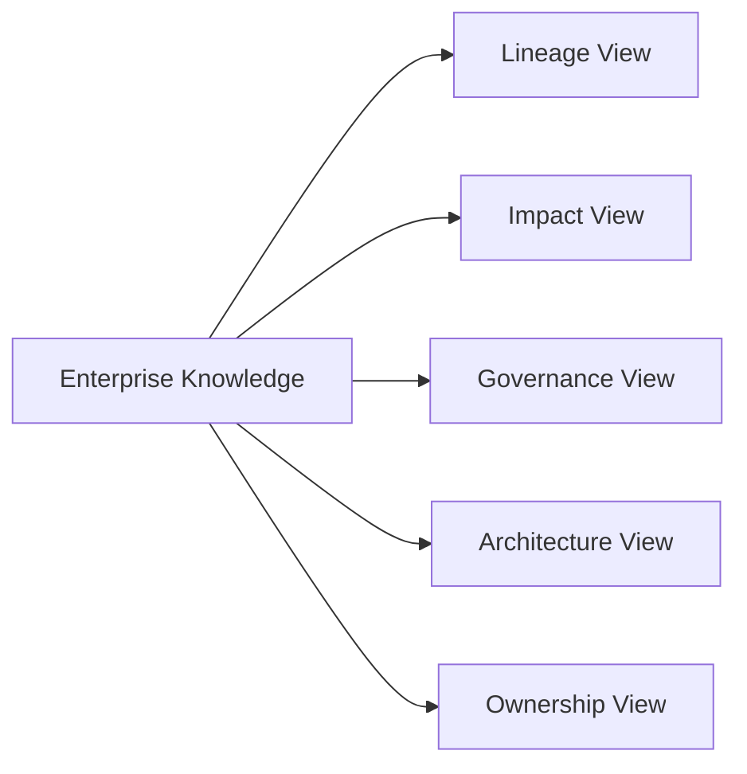

---

# 15. Why Not RDF/OWL/SHACL

Assessment:

Theoretical fit > High.
Practical fit > Questionable.

Reasons:

- low industry momentum
- limited community adoption
- specialized skills
- increased key-person risk

Current architecture already provides:


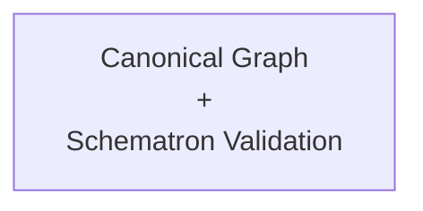

which delivers many practical benefits without introducing semantic-web complexity.

---

# 16. Neo4j Discussion

Potential role:


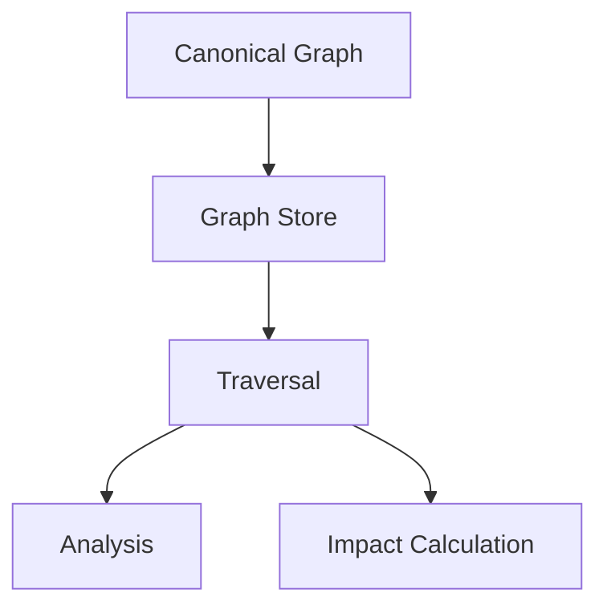

Neo4j is attractive because:

- graph traversal
- path discovery
- impact analysis
- dependency exploration

Reason to consider:

Developer-centric analysis.

Not ontology purity.

---

# 17. BCBS239 Alignment

Possibly the strongest business justification.

Supports:

- traceability
- lineage
- impact analysis
- governance
- completeness
- adaptability
- data integrity

Key message:

> The platform enables continuous evidence generation for BCBS239 rather than periodic documentation exercises.

---

# 18. Change Management Impact

Traditional:


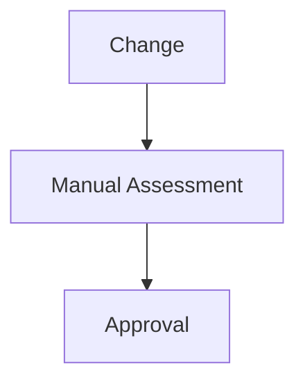

Future:


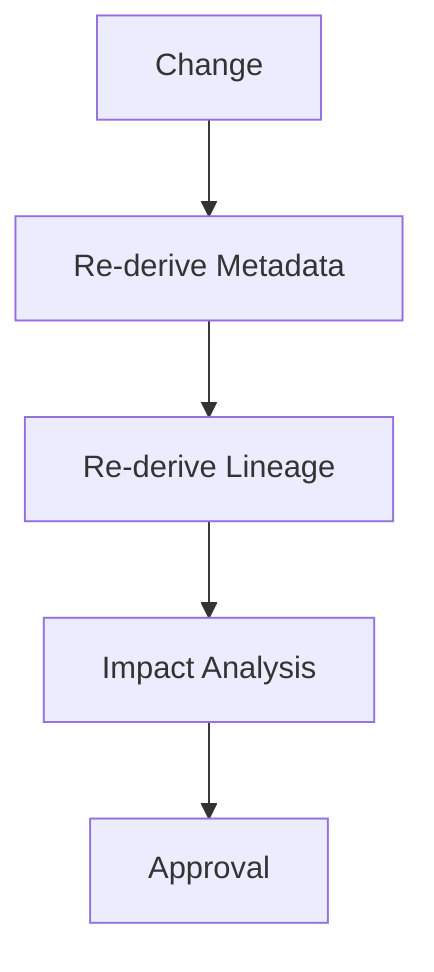

Benefits:

- reduced risk
- faster assessments
- better evidence
- less tribal knowledge dependency

---

# 19. Architecture Drift Detection

Critical capability.

Compare:

```text
Intended Architecture
```

vs

```text
Observed Reality
```

Result:

```text
Drift Detection
```

Example:

```text
Expected:
App A → Service B → DB C

Observed:
App A → DB C
```

This becomes automatically detectable.

---

# 20. Sustainability Story

Not primarily environmental sustainability.

Primary focus:

## Knowledge Sustainability

Reduce loss of expert knowledge.

Transform:

```text
People
```

into:

```text
Models
Rules
Derivations
Graphs
```

---

## Change Sustainability

Reduce repeated rediscovery effort.

---

## Governance Sustainability

Maintain metadata through derivation.

Not manual updates.

---

## AI Sustainability

Create structured enterprise knowledge rather than isolated documents.

---

# 21. AI Opportunity

Potentially significant.

The most valuable AI asset may be:

```text
Canonical Enterprise Graph
```

Because it captures:

- ownership
- architecture
- lineage
- dependencies
- constraints
- intent
- reality

Concept:


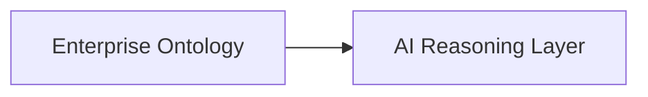

Rather than:


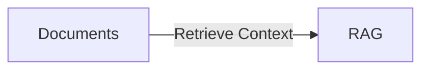
---

# 22. Enterprise Knowledge Compiler

Emerging overall characterisation:

Not:

```text
Lineage Tool
```

Not:

```text
Architecture Repository
```

Not:

```text
Governance Platform
```

Instead:

```text
Enterprise Knowledge Compiler
```

Inputs:

- ArchiMate
- code
- metadata
- configuration
- implementation artifacts

Output:

- validated graph
- lineage
- impact analysis
- Collibra exports
- architecture validation
- developer debugging capabilities

---

# 23. Key Stakeholder Message

Executive version:

> We continuously reconcile implementation reality and architectural intent into a validated enterprise graph from which lineage, impact analysis and governance metadata are automatically derived.

Architect version:

> Inferable knowledge is continuously derived. Only non-inferable knowledge is modeled. Both are reconciled into a canonical graph and validated through executable architecture rules.

Developer version:

> It is a lineage debugger and impact analysis platform built on continuously derived architectural knowledge.

BCBS239 version:

> The platform continuously generates and validates traceability and dependency evidence from actual implementation artifacts and architectural knowledge.

---

# 24. Potential Whitepaper Thesis

Working title:

## Near-Reality Lineage:
### Reconciling Implementation Reality and Architectural Intent

Core thesis:

> Perfect lineage is unattainable. Near-reality lineage is achieved by continuously deriving inferable knowledge, explicitly modeling non-inferable knowledge, reconciling both into a canonical enterprise graph, validating that graph, and deriving lineage from it.

Alternative broader thesis:

## Executable Enterprise Architecture

> Enterprise architecture should behave like source code: continuously validated, continuously reconciled and continuously generating lineage, impact analysis and governance evidence.

<!-- BACKMATTER.BEGIN -->
⬅️ [architecture-overview](architecture-overview.md) | ➡️ [fd-docx-diagram-intro](fd-docx-diagram-intro.md)
<!-- BACKMATTER.END -->

---
